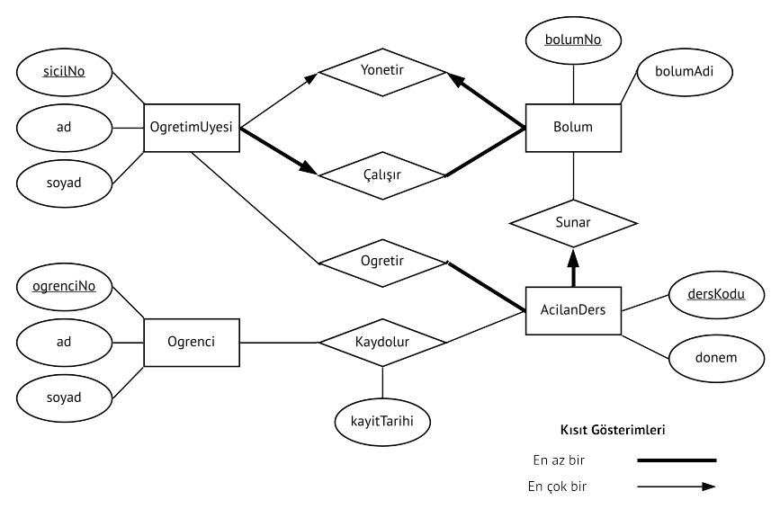
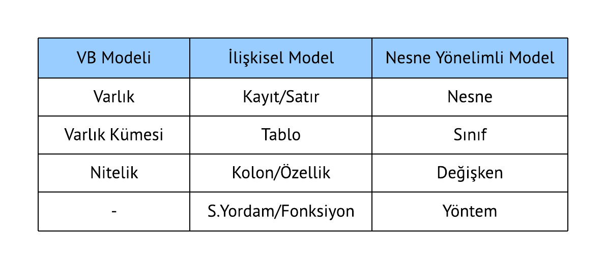

BSM211 Veritabanı Yönetim Sistemleri - Celal ÇEKEN, İsmail ÖZTEL, Veysel Harun ŞAHİN

# İş Kuralları ve Veri Modelleri

## Konular

* Veritabanı Tasarımı Yaşam Döngüsü Veri Modeli Nedir?
* Veri Modeli Temel Bileşenleri
* İş Kuralları (Business Rules)
* İş Kurallarını Veri Modeline Dönüştürme Veri Modellerinin Gelişimi
* Dosya Sistemi
* Hiyerarşik Model
* Ağ Modeli
* İlişkisel Veri Modeli Varlık Bağıntı Modeli
* Nesne Yönelimli Model
* Yeni Veri Modelleri
* Veri Soyutlama
* Kaynaklar

## Veritabanı Geliştirme Yaşam Döngüsü

## İş Kuralları (Business Rules)

* Veritabanı (varlık, nitelik, ilişki ve kısıtlar) oluşturulurken iş kurallarına bakılır.
* **İş kuralı:** Veritabanı tasarımı yapılacak organizasyon ile ilgili işleyiş, kural ya da  yönetmeliğin özetlenmiş şekline iş kuralları denilebilir. İş kuralları ihtiyaç listesine benzer.
* Örnek iş kuralları:
+ Bir müşteri çok sayıda sipariş verebilir.
+ Her müşterinin adı, soyadı, telefon numarası vs. istenir.
+ Öğrenciler bir ara sınav ve bir yarıyıl sonu sınavına girerler.
* İş kurallarının kaynağı, uç kullanıcılar, yöneticiler, kural koyucular ve yazılı dokümanlar (standart, yönetmelik vs.) olabilir.
* İş kurallarını oluşturmak için doğrudan uç kullanıcılarla görüşmek oldukça etkili bir çözümdür.
* Veritabanı tasarımı açısından iş kurallarının önemi;
    + Kullanıcılar ile tasarımcılar arasındaki iletişimi sağlar.
    + Tasarımcının verinin doğasını, önemini ve kapsamını anlamasını sağlar.
    + Tasarımcının iş süreçlerini anlamasını sağlar.
    + Tasarımcının doğru bir veri modeli geliştirmesine yardım eder (veriler arası ilişkiler ve kısıtların kolayca belirlenmesini sağlar).
    + Kuruluşun veriye bakışını standart haline getirir.
* İş kuralları oluşturulduktan sonra, gerçekleştirilecek veritabanının modellenmesi aşamasına geçilir.

## Veri Modeli

* **Veri modeli:** Karmaşık gerçek dünya veri yapılarının basit olarak gösterilmesi (genellikle grafiksel) için kullanılan araca veri modeli ismi verilir.
* Veri modeli, veritabanı tasarımcıları, uygulama programcıları ve uç kullanıcılar arasındaki iletişimi kolaylaştırır.
* Veri modelleri sayesinde veritabanı tasarımını gerçekleştirmek daha kolay olur.
* Veri modelleme yinelemeli (iterative) bir işlemdir. Önce basit model oluşturulur. Daha sonra ayrıntılar eklenir. En sonunda veritabanı tasarımında kullanılan şablon (blueprint) elde edilir.

## Veri Modelinin Temel Bileşenleri

* **Varlık (Entity):** Hakkında veri toplanan ve saklanan her şey (öğrenci, ders, personel vb.). Gerçek dünyadaki nesneleri ifade eder. Var olan ve benzerlerinden ayırt edilebilen her şey.
* **Varlık kümesi (Entity set):** Aynı türden benzer varlıkların oluşturduğu kümeye denir (Öğrenciler,  Dersler vb.).
* **Nitelik (Attribute):** Varlığın sahip olduğu özellikler.
* **Bağıntı (Relationship):** Varlıklar arasındaki ilişkiyi ifade eder. 
    + Bir-Çok (One to Many 1:M)
    + Bir müşteri çok sayıda sipariş verebilir.
        + Her sipariş yalnızca bir müşteri tarafından verilir.
        + Çok-Çok (Many to Many M:N)
    + Bir öğrenci çok sayıda ders alabilir.
        + Her ders çok sayıda öğrenci tarafından alınabilir.
    + Bir-Bir (One to One 1:1)
        + Bir mağaza bir personel tarafından yönetilir.
        + Bir personel bir mağazayı yönetir.
* **Kısıtlar (Constraints):** Veri üzerindeki sınırlamalardır. Veri bütünlüğünün sağlanması açısından önemlidir. Örneğin;
    + Öğrenci notunun 0-100 arasında olması
    + T.C. kimlik numarasının 11 karakter olması
    + Aynı ürünün birden fazla kayıt edilememesi

## Veri Modellerinin Gelişimi

* Dosya Sistemi  
* Hiyerarşik Model  
* Ağ Modeli 
* İlişkisel veri modeli
* Varlık Bağıntı modeli
* Nesne Yönelimli Model 
* Yeni Veri Modelleri

## Dosya Sistemi

* 1960-1970 lerde çoğunlukla IBM ana çatı (mainframe) sistemlerde kullanılmıştır
* Dosyalar arasında ilişki yoktur.
* Örnek bir dosya yapısı aşağıda görünmektedir.

## Hiyerarşik Model

* 1960’larda büyük miktardaki verileri yönetebilmek için geliştirilmiştir.
* Veriler ağaç yapısı şeklinde organize edilir.
* Ana-çocuk (parent-child) arasında 1:M ilişkisi vardır. Kayıtların sadece 1 ana (parent) kaydı vardır.

## Ağ Modeli

* 1970’lerde geliştirilmiştir. Veritabanı başarımını artırmak üzere daha karmaşık ilişkilere izin verilir.
* Hiyerarşik modelden farklı olarak kayıtların birden fazla ana (parent) kayıtları olabilir.
* Ağ veri modeliyle birlikte ortaya çıkan ve hala kullanılan bazı kavramlar aşağıdadır.
* **Şema:** Tüm veritabanının, veritabanı yöneticisi tarafından görünen kavramsal organizasyonu.
* **Alt şema:** Veritabanının istenen bilgiyi üreten uygulama programı tarafından görünen kısmı.
* **Veri işleme dili (data manipulation language, DML):** Veritabanında bulunan verilerin, sorgulama işlemleri yapılarak güncellenmesi, yeni verilerin eklenmesi ve olan verilerin silinme işlemlerinin yapılmasını sağlayan dil.
* **Veri tanımlama dili (data definition language, DDL):** Veritabanında bulunan verilerin tip, yapı ve kısıtlamalarının tanımlanmasını sağlayan dil.
* Ağ modelinin dezavantajı, çok basit sorgular için bile karmaşık program kodlarının kullanımını gerektirmesidir.
* **Ad hoc query:** Yazılımlarla birlikte gelmeyen kullanıcının kendi oluşturduğu sorgulara verilen isimdir.

## İlişkisel Veri Modeli

* 1970’de E. F. Codd tarafından ortaya atılmıştır (A Relational Model of Data for Large Shared Databanks, Communications of the ACM, June 1970, pp. 377−387).
* İlişkisel Veritabanı Yönetim Sistemleri (Relational Database Management Systems, RDBMS) tarafından kullanılır. 
* RDBMS’nin en önemli özelliklerinden birisi ilişkisel modelin karmaşık yapısını kullanıcıdan gizlemesidir.
* Kullanıcı, ilişkisel modeli, verileri içeren tablolardan oluşan bir yapı gibi görür.
* Tablolar birbirlerine ortak alanlarla bağlanırlar.
* İlişkisel şema, varlıklar, varlıkların nitelikleri ve aralarındaki  bağlantıların gösteriminden oluşur.

* İlişkisel veritabanı modelinin en güçlü yanlarından birisi, verileri yönetmek için yapısal sorgulama dili (structured query language, SQL) dilinin  kullanılıyor olmasıdır.
* SQL dili nasıl yapılması gerektiğini anlatmak yerine ne yapılması gerektiğinin ifade edildiği basit bir dildir.
* Bu nedenle, SQL kullanılarak veri tabanlarının tasarımı ve yönetimi daha kolaydır.
* İlişkisel bir veritabanı yönetim sistemi 3 temel bileşenden oluşur.
    + Verilerin saklandığı veritabanı
    + SQL komutlarını derleyerek istenenleri gerçekleştiren SQL Motoru (SQL Engine)
    + Kullanıcılarla iletişimi sağlayan arayüzler.

## Varlık Bağıntı Modeli

* İlişkisel model daha önceki modellere göre çok daha kullanışlı olmasına rağmen veritabanı tasarımı için ilişkisel modelin grafiksel gösterimi olan varlık bağıntı modeli (VBM) (entity relationship model, ERM) daha sık kullanılır.
1976’da Peter Chen tarafından önerilmiştir.
* İlişkisel veri modelinin tamamlayıcısı olduğu için kullanımı oldukça yaygınlaşmıştır.
* i) Chen gösterimi ve ii) Crow’s Foot gösterimi sıkça kullanılan gösterim şekillerindendir.
* Ders kapsamında Crow’s Foot gösterimi kullanılacaktır.

### Chen Gösterimi

### Crow’s Foot Gösterimi

## Nesne Yönelimli Model

* Nesne yönelimli programlama paradigmasından esinlenerek geliştirilen modeldir.
* Varlık bağıntı (VB - ER) modelindeki varlık (entity) bu modelde nesne olarak adlandırılır.
* Nesne hakkındaki bilgi, VB modelindeki niteliklere karşılık gelir. 
* Varlık kümesi sınıf olarak adlandırılır.
* VB modelinden farklı olarak sınıflar üye fonksiyonlara da sahiptirler. Kisi ara, Ad listele vb.

## Yeni Veri Modelleri

* Nesne İlişkisel Model (Object/Relational Model)
    + İlişkisel modelle nesne yönelimli modelin birleştirilmesi sonucu ortaya çıkmıştır.
* Genişletilebilir İşaretleme Dili (Extensible Markup Language, XML)
    + Çoğunlukla, farklı platformlar arası veri değişimi için kullanılan veri tanımlama standardıdır. Yapısal olmayan verileri tanımlamak için de kullanılır.
* JavaScript Nesne Gösterimi (JavaScript Object Notation, JSON)
    + Çoğunlukla, farklı platformlar arası veri değişimi için kullanılan veri tanımlama standardıdır. Yapısal olmayan verileri tanımlamak için de kullanılır.
* NoSQL
    + İlişkisel modelin yetersiz kaldığı büyük hacimli verilerin yönetimi için tercih edilir.

## Veri Soyutlama

Veri modellerinin daha iyi anlaşılabilmesini sağlamak amacıyla ANSI-SPARC, 1970’lerin başında, veri soyutlamanın 3 düzeyini tanımlamıştır. (ANSI-SPARC: American National Standards Institute, Standards Planning and Requirements Committee.)

* Harici Model (External Model)
* Kavramsal Model (Conceptual Model)
* Dahili Model (Internal Model)

### Harici Model (External Model)

* Veritabanının uç kullanıcılar açısından görünen kısmı. Veritabanının sadece kullanıcıyla ilgili alt bölümlerini ifade eder.

### Kavramsal Model (Conceptual Model)

* Veritabanının veritabanı tasarımcısı açısından görünen kısmı. Veritabanının tüm alt bölümlerini birleştirerek global olarak görünmesini sağlar.
* Varlık Bağıntı Diyagramı (VBD – ERD) ile gösterilir. Kullanılan yazılım (DBMS) ve donanımdan bağımsızdır. Donanım ya da yazılım değişikliği kavramsal model tasarımını etkilemez.
* Kavramsal model mantıksal görünüş olarak da kullanılır.

### Dahili Model (Internal Model)

* Veritabanının, Veritabanı Yönetim Sistemi tarafından görünen kısmı. 
* Dahili model = ilişkisel model 
* Donanım bağımsız, yazılım bağımlı.

## Kaynaklar

* Carlos Coronel, Steven Morris, and Peter Rob, Database Systems: Design, Implementation, and Management, Cengage Learning.
