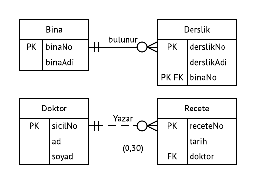
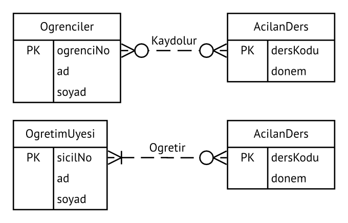
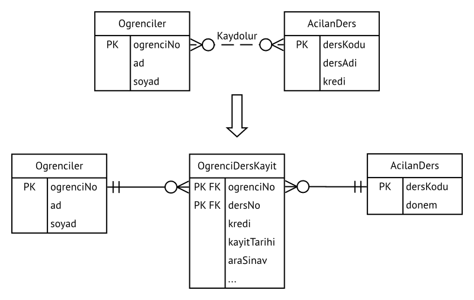
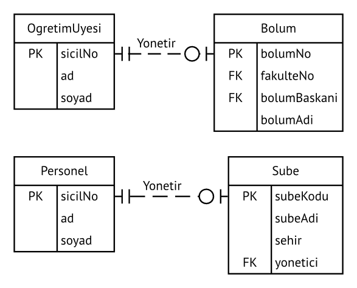
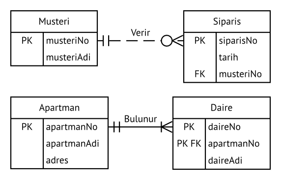
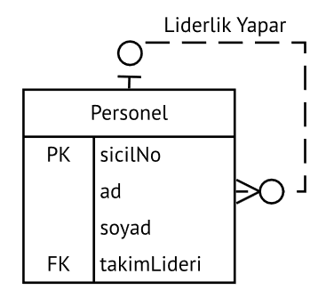
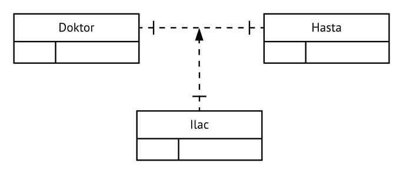

BSM211 Veritabanı Yönetim Sistemleri - Celal ÇEKEN, İsmail ÖZTEL, Veysel Harun ŞAHİN

# Veritabanı Kavramı - Varlık Bağıntı Modeli

## Konular

* Veritabanı Tasarım Aşamaları
* Kavramsal Tasarım
* Temel Kavramlar
* Varlıklar Arası Bağıntılar
* Var Olma Bağımlılığı (Existence Dependency)
* Zayıf/Güçlü Bağıntılar
* Bağıntı Dereceleri
* Varlık Bağıntı Modeli (VBM/ERM) ile Tasarım
* Kaynaklar

## Veritabanı Geliştirme Yaşam Döngüsü

## Temel Kavramlar

* Varlık Bağıntı Diyagramı (VBD, Entity Relationship Diagram (ERD)) veritabanının kavramsal olarak modellenmesini sağlayan yazılım ve donanımlardan tamamen bağımsız gösterim şekilleridir.
* Farklı kullanıcılar arasında haberleşmeyi sağlamak için kullanılır.
* VB modeline bakarak veri tabanının tasarımını gerçekleştirmek daha kolaydır.
* VBD, veritabanının temel bileşenleri olan varlık, nitelik (özellik), varlıklar arası bağıntılar (relationship) ve kısıtlardan meydana gelen çizelgelerdir.
* Chen notasyonu kavramsal modellemeyi ön plana çıkartır.
* Crow's Foot notasyonu ise daha çok uygulama (implementasyon) yönelimli yaklaşımı ön plana çıkartır.
* UML notasyonu, hem kavramsal hem de uygulama (implementasyon) modelleme yöntemleri için kullanılabilir.

## İş Kurallarını Varlık Bağıntı Modeline Dönüştürme

* Genel olarak iş kurallarındaki isimler varlık, fiiller ise varlıklar arasındaki bağıntı olma adayıdır.
* Hakkında bilgi bulunan isim ya da isim tamlamaları varlık adayı iken, bilgi bulunmayanlar varlığa ait nitelik adayıdır.
  + _Müşterinin_ **ad, soyad, numara, adres** bilgileri saklanır.
  + Bir _müşteri_ çok sayıda **fatura üretir**.
* İlişkiler iki yönlüdür.
  + **1 öğretim üyesi çok** sayıda (4) **ders** verebilir
  + **1 ders** sadece **1 öğretim üyesi** tarafından verilebilir.
  + **1 kişi 1 bölüme** yönetici olabilir.
  + **1 bölüm** sadece **1 kişi** tarafından yönetilebilir.
  + **1 öğrenci çok** sayıda **derse** kayıt yaptırabilir
  + **1 ders çok** sayıda **öğrenci** tarafından alınabilir.
* İsimlendirme kuralları
* Kodlama türleri
  + Linux Coding Style, Linus Torvalds
  + Hungarian Notation,
  + GNU Coding Standards
  + Java Coding Style Guide
  
## Temel Kavramlar

* Birincil anahtarlar (primary key) tek bir alan olabileceği gibi birden fazla alanın birleşiminden de oluşabilir.
  + urunKodu
  + dersKodu + ogrenciNo
* Birleşik nitelikler:
  + adres: cadde, şehir, ülke, posta kodu vb.
  + Detaylı sorgular için basit özellikli alanlara dönüştürülmeliler.
* Basit nitelikler
  + yaş, ad, soyad, cinsiyet vb.
* Çoklu değer alan nitelikler
  + filmTuru: Komedi, Macera, Korku, Komedi-Macera vb.
  + İki çözümü vardır.
    + Farklı alanlarda saklanabilir.
    + Yeni bir  ilişki (tablo, varlık) oluşturulabilir.
    

* Türetilmiş nitelikler
  + Değeri diğer özellikler kullanılarak oluşturulan özellikler.
  ~~~~sql
  SELECT AVG(AGE(dogumTarihi)) FROM Kisiler
  ~~~~
  + Saklanmalı mı, hesaplanmalı mı?
  

* Saklanması Durumunda:
  + Avantaj: Az işlemci gücü gerekir, veriye daha hızlı erişim, geçmiş bilgisi için kullanılabilir
  + Dezavantaj: Güncel değer için sürekli denetlenmelidir, fazladan yer kaplar
* Hesaplanması Durumunda:
  + Avantaj: Yer tasarrufu sağlar. Her an güncel değer olur.
  + Dezavantaj: Çok işlemci gücü gerekir, veriye daha yavaş erişim olur, sorgular daha karmaşık olur.

## Varlıklar Arası Bağıntılar
### Bir - Çok Bağıntısı
* **1 derslik** sadece **1 binada** bulunabilir.
* **1 binada çok** sayıda **derslik** bulunabilir.

* Normal şartlarda tablo içerisindeki kayıt sayısı sınırlanamaz. Bunun için uygulama yazılımları ya da tetikleyiciler (trigger) kullanılabilir.
* Kayıt sayılarının gösterilmesi uygulama yazılımı geliştirilirken çok faydalıdır. (Sınıfın açılabilmesi için en az 10 kayıt, en fazla 30 kayıt gereklidir. Bir doktor bir günde en fazla 30 reçete yazabilir...)
* Sayılar iş kurallarına bakılarak belirlenir.

### Çok - Çok Bağıntısı
* **1 öğrenci çok** sayıda **derse** kayıt yaptırabilir
* **1 ders  çok**  sayıda **öğrenci** tarafından alınabilir.

### Bir - Bir Bağıntısı

* **1 öğretim üyesi 1 bölüm** yönetebilir
* **1 bölüm 1 öğretim üyesi** tarafından yönetilebilir.

### Var Olma Bağımlılığı (Existence Dependency)

* Bir site yönetim sistemi bilgi sistemi düşünelim.
* Bu sistemde Apartman ve Daire varlık kümeleri olsun.
* Böyle bir sistemde «**bir apartmana bağlı olmayan daire olama**z» kuralı mevcuttur.
* Örneğin Daire varlık kümesine hiçbir apartmana ait olmayan bir dairenin kaydını yapamayız, yapmamalıyız.
* Bu örnekte, Apartman ve Daire arasında var olma bağımlılığı vardır denir.
* Bu durumda Apartman üstün varlık, Daire ise bağımlı varlıktır.

Bir personel bilgi sisteminde Personel ve Bagimli (Personele bagimli olan kişiler. Örneğin çocuk, eş vb.) varlık kümelerini düşünelim. Böyle bir sistemde «**bir personele bağlı olmayan bagimli varlığı olamaz**» kuralı mevcuttur. Örneğin bagimli varlık kümesine hiçbir personele ait olmayan bir çocuğun kaydını yapamayız, yapmamalıyız. Bu örnekte, bagimli ve personel arasında var olma bağımlılığı vardır denir. Bu durumda personel **üstün varlık**, bagimli ise **bağımlı varlıktır**.

### Zayıf/Güçlü Bağıntılar

* Bağıntı kurulan varlığın birincil anahtarı içerisinde, bağıntı kuran varlığın birincil anahtar bilgisi yer almıyorsa “iki varlık arasında zayıf bağıntı vardır” denir.
* Bağıntı kurulan varlığın birincil anahtarı içerisinde, bağıntı kuran varlığın birincil anahtarı yer alıyorsa “iki varlık arasında güçlü bağıntı vardır” denir.

### Bağıntı Dereceleri

* Tekli (Unary) Bağıntı
* İkili (Binary) Bağıntı
* Üçlü (Ternary) Bağıntı

### Tekli Bağıntı

* **Tekli (Unary) Bağıntı:** Bir varlık kendisi ile bağıntılı (ilişkili) ise bu tür bir bağıntıya tekli bağıntı adı verilir.
* Örneğin, Personel tablosu içerisindeki bir personel, sıfır veya daha fazla personelin aynı zamanda yöneticisidir. Bir personelin sıfır ya da bir yöneticisi olmalıdır.

### İkili Bağıntı

* **İkili (Binary) Bağıntı:** İki varlığın bağıntısına (ilişkisine) ikili bağıntı denir.

### Üçlü Bağıntı

* **Üçlü (Ternary) Bağıntı:** Aynı anda 3 varlık birbirine bağlanıyorsa, bu tür bağıntıya üçlü bağıntı adı verilir.
* Kavramsal tasarımda her ne kadar 3 varlık mevcut ise de bunu gerçekleştirebilmek için 4. bir varlığa gereksinim duyulur.

### Varlık Bağıntı Modeli (VBM/ERM) ile Tasarım

* Veritabanı tasarımı, lineer ya da ardışıl  (yazılım geliştirmedeki şelale modeli gibi) olmaktan çok tekrarlı (yazılım geliştirmedeki spiral yöntem ya da iteratif yaklaşım gibi) bir süreçtir.
* Tekrar fiili, “tekrar tekrar yap” anlamındadır. Tekrarlı bir süreç, süreçlerin ve prosedürlerin tekrarlanması temeline dayanır.
* Bir varlık bağıntı diyagramının geliştirilmesi genellikle aşağıdaki adımları içermektedir.
  + Organizasyonun (kurumun) işlerinin (operasyonlarının) tanımını içeren detaylı bir senaryo (hikaye) oluşturulur. Senaryo özellikle organizasyon içerisindeki rol temsilcilerine danışılarak oluşturulursa çok daha gerçekçi ve etkili olur.
  + Senaryoda geçen işlerin tanımları baz alınarak iş kuralları oluşturulur.
  + İş kuralları baz alınarak ana varlıklar ve varlıklar arasındaki bağıntılar oluşturulur.
  + İlk varlık bağıntı diyagramı geliştirilir.
  + Varlıkları net bir şekilde tanımlayan özellikleri ve birincil anahtarları oluşturulur.
  + Varlık Bağıntı Diyagramı gözden geçirilerek gerekirse yukarıdaki adımlar, istenilen duruma gelininceye kadar tekrarlanır.

### Kaynaklar

* Carlos Coronel, Steven Morris, and Peter Rob, Database Systems: Design, Implementation, and Management, Cengage Learning. 

