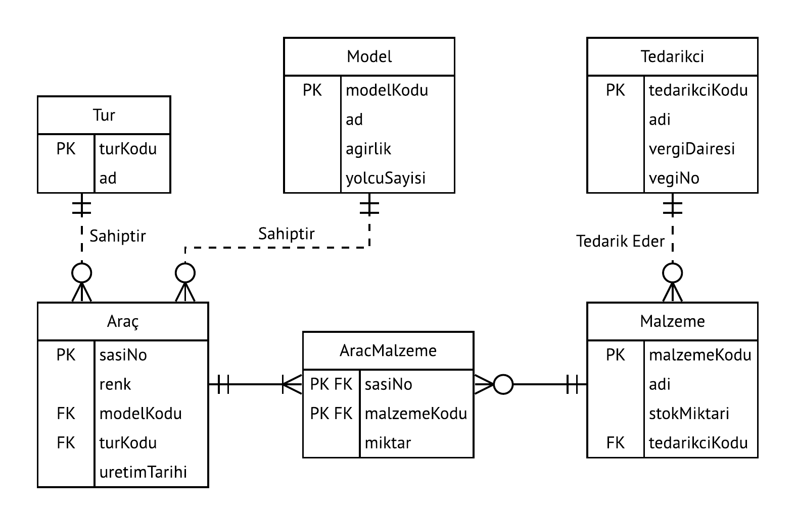
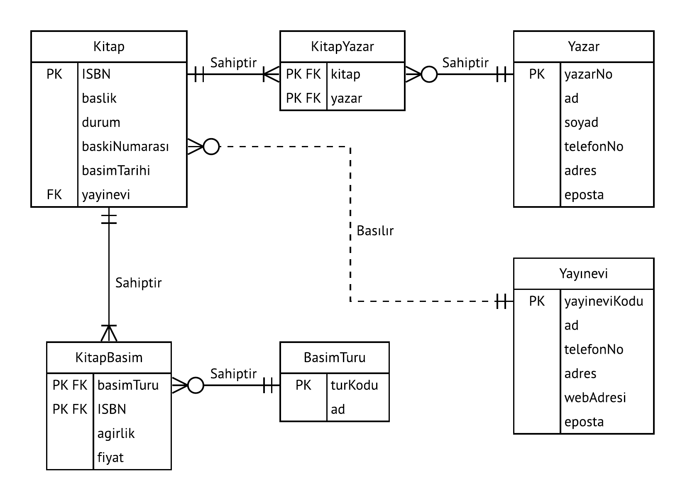
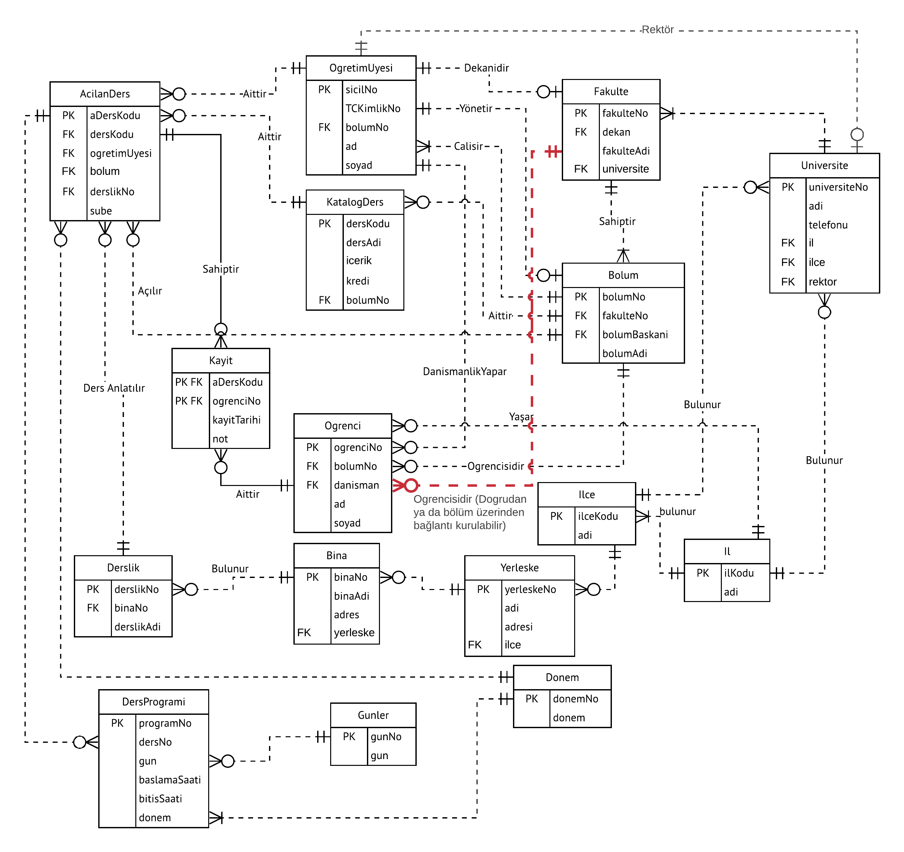
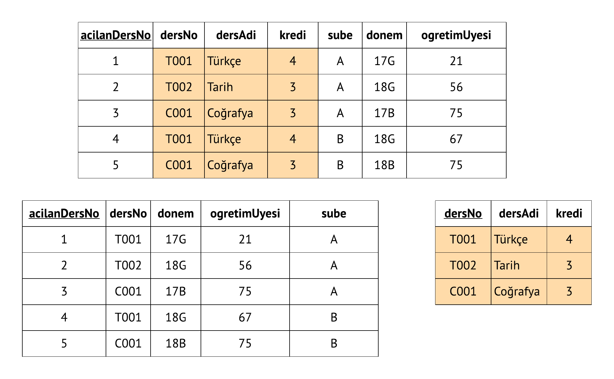

BSM211 Veritabanı Yönetim Sistemleri - Celal ÇEKEN, İsmail ÖZTEL, Veysel Harun ŞAHİN

# Varlık Bağıntı Modeli - Örnek Uygulamalar

## Konular

* Varlık Bağıntı Modeli (VBM/ERM) ile Tasarım
* Örnek Uygulama – Araç Üreticisi
* Örnek Uygulama – Kitabevi Yazılımı
* Örnek Uygulama – Üniversite Bilgi Sistemi
* Kaynaklar

## Varlık Bağıntı Modeli (VBM/ERM) ile Tasarım

Veritabanı tasarımı, lineer ya da ardışık olmaktan çok tekrarlı bir süreçtir. Tekrar fiili, “tekrar tekrar yap” anlamındadır ve tekrarlı bir süreç, süreçlerin ve prosedürlerin tekrarlanması temeline dayanır.  Bir varlık bağıntı diyagramının geliştirilmesi genellikle aşağıdaki adımları içermektedir:
1. Organizasyonun (kurumun), işlerinin (operasyonlarının) tanımını içeren detaylı bir senaryo (hikaye) oluşturulur. (Hikaye özellikle organizasyon içerisindeki rol temsilcilerine danışılarak oluştrulursa çok daha gerçekçi ve etkili olur)
2. Senaryoda geçen işlerin tanımları baz alınarak iş kuralları oluşturulur.
3. İş kuralları baz alınarak ana varlıklar ve varlıklar arasındaki bağıntılar oluşturulur.
4. İlk varlık bağıntı diyagramı geliştirilir.
5. Varlıkları net bir şekilde tanımlayan özellikleri ve birincil anahtarları oluşturulur.
6. Varlık Bağıntı diyagramı gözden geçirilerek gerekirse yukarıdaki adımlar, istenilen duruma gelininceye kadar, tekrarlanır.

## Örnek Uygulama - Araç Üreticisi

### Senaryo

Bir araç üreticisi, farklı modellerde araçlar üretmektedir. Ürettiği araçlar, araçlarda kullanılan malzemeler, tedarikçiler vb. bilgilerini saklamak ve yönetmek istediği bir yazılım sistemi talep etmektedir.

### İş Kuralları

* Üretilen her bir aracın şasi numarası, renk, tür (otomobil, kamyon, minibüs vb.), model ve üretim tarihi bilgileri mevcuttur. Araçlar birbirinden şasi numarası ile ayırt edilir.
* Araç türlerinin kodu ve adı bilgileri mevcuttur.
* Araç modellerinin kodu, adı, ağırlık ve yolcu sayısı bilgileri mevcuttur.
* Malzemelerin kodu, adı, stok miktarı bilgileri mevcuttur.
* Malzemeler tedarikçi şirketlerden satın alınmaktadır.
* Tedarikçi şirketlerin kodu, adı, vergi dairesi, vergi numarası bilgileri mevcuttur.
* Bir tedarikçi hiçbir malzeme tedarik etmeyebileceği gibi bir veya daha fazla malzeme de tedarik edebilir. Bir malzeme yalnızca bir tedarikçi tarafından temin edilir.
* Bir araç çok sayıda malzemeden oluşur. En az bir adet malzemeden oluşmak zorundadır. Bir malzeme birden fazla araçta kullanılabilir. Ancak henüz hiçbir araçta kullanılmamış da olabilir.
* Araçlar farklı miktarda ve farklı türlerde malzemelerden üretilir. Bu bilgiler de kaydedilmelidir.
* Bir araç yalnızca bir türe sahip olur. Bir türe ait hiçbir araç olmayabileceği gibi çok sayıda araç da olabilir.
* Bir araç yalnızca bir modele sahip olur. Bir modele ait hiçbir araç olmayabileceği gibi çok sayıda araç da olabilir.

### Varlık Bağıntı Diyagramı

<!--
## Örnek Uygulama - Kitabevi Yazılımı

### Senaryo

Geliştirilecek kitabevi yazılımı için veritabanı tasarlanması istenmektedir. Veritabanında kitabevinde satılan kitaplar ile bu kitapların yazarları ve yayınevleri hakkında bilgiler bulunması beklenmektedir.

### İş Kuralları

* Her kitabın ISBN, başlık, ağırlık, durum (yeni, kullanılmış), basım türü (kağıt kapak, karton kapak, elektronik), baskı numarası, basım tarihi bilgilerine sahiptir.
* Kitapların basım türlerine göre farklı fiyatları ve ağırlıkları mevcuttur.
* Kitaplar yayınevleri tarafından basılır.
* Yayınevlerinin kodu, adı ve telefon numarası, web adresi, e-posta adresi ve adres bilgileri mevcuttur.
* Yazarların yazar numarası, adı, soyadı, telefon numarası, e-posta, adres bilgileri mevcuttur.
* Bir kitabın bir baskısı yalnızca bir yayınevi tarafından basılır. Bir yayınevinin hiçbir kitabı olmayabilir ancak birden fazla kitabı da olabilir.
* Bir kitabın çok sayıda basım türü olabilir. En az bir basım türü olmak zorundadır. Bir basım türüne ait çok sayıda kitap olabilir. Hiçbir kitap da olmayabilir.
* Bir kitabın en az bir yazarı olmalıdır ancak birden fazla yazarı da olabilir. Bir yazarın hiçbir kitabı olmayabilir ancak çok sayıda kitabı da olabilir.

### Varlık Bağıntı Diyagramı

-->

## Örnek Uygulama - Üniversite Bilgi Sistemi

### Senaryo

Üniversite bilgi sisteminde, bir üniversiteye ait bilgilerin depolanması ve yönetilmesi istenmektedir. Daha özelde fakültelerin, bölümlerinin, bölümlerin sunduğu derslerin, öğretim üyelerinin, açılan derslerin, açılan derslerin dersliklerinin, öğrencilerin, öğrencilerin açılan derslere yaptıkları kayıtların, üniversitedeki binaların ve binalardaki dersliklerin bilgilerinin saklanması istenmektedir.

### İş Kuralları

* Üniversite fakültelerden oluşur.
* Üniversite yöneticileri (rektör) ve fakülte yöneticileri (dekan) öğretim üyelerinden seçilir.
* Fakülteler bölümlerden oluşur. Bölümün adı ve öğretim üyelerinden seçilen bir başkanı bulunur.
* Öğretim üyesi bilgileri içerisinde kimlik numarası, adı, soyadı, ve bağlı bulunduğu (görev yaptığı) bölüm bilgileri bulunmalıdır.
* Bölümlerin sunduğu dersler (katalog dersler) bilgileri içerisinde ders kodu, ders adı, kredisi ve dersi sunan bölümün bilgisi olmalıdır.
* Açılan dersler bilgileri içerisinde açılan dersin kodu, katalog ders bilgisi (kodu), bölümü, şube bilgisi, dersi veren öğretim üyesi ve dersin yapıldığı dersliğin bilgisi olmalıdır.
* Öğrenci bilgileri içerisinde öğrenci numarası, bölüm numarası, adı, soyadı ve danışman hocasının bilgisi yer almalıdır.
* Öğrencilerin açılan derslere yaptıkları kayıtlar, kayıt tarihleri ve o derslerden aldıkları notlar da saklanmalıdır.
* Bina bilgileri içerisinde bina adı ve yeri bilgileri bulunmalıdır.
* Derslik bilgileri içerisinde derslik kodu ve dersliğin hangi binada bulunduğuna ilişkin bilgiler bulunmalıdır.
* Bir fakültenin yalnızca bir tane dekanı (öğretim üyeleri içerisinden) olmak zorundadır. Bir öğretim üyesi en fazla bir fakültenin dekanı olabilir.
* Bir fakültenin en az bir bölümü olmak zorundadır ancak birden fazla bölümü de olabilir. Bir bölüm ise yalnızca bir fakültenin altında yer alabilir.
* Bir öğretim üyesi yalnızca bir bölüme bağlıdır. Bir bölümün en az bir öğretim üyesi olmak zorundadır ancak birden fazla öğretim üyesi da olabilir.
* Bir bölüm yalnızca bir öğretim üyesi tarafından yönetilmek zorundadır. Bir öğretim üyesi ise en fazla bir bölümün yöneticiliğini yapabilir.
* Bir öğretim üyesi çok sayıda öğrencinin danışman hocası olabilir. Bir öğrencinin danışmanlığını yalnızca bir tane öğretim üyesi yapabilir.
* Bir bölümün çok sayıda öğrencisi mevcuttur. Bir öğrenci, yalnızca bir tane bölümün öğrencisidir.
* Bir öğretim üyesi birden fazla (açılan) ders verebilir. Bir (açılan) ders yalnızca bir öğretim üyesi tarafından verilmelidir.
* Bir bölüm çok sayıda katalog ders sunabilir. Bir katalog ders yalnızca bir bölüm tarafından sunulur.
* Bir katalog dersin çok sayıda açılan dersi (şubesi) olabilir. Bir açılan dersin yalnızca bir tane katalog dersi olmalıdır.
* Bir öğrenci birden fazla derse kayıt yaptırabilir. Bir derse birden fazla öğrenci kayıt olabilir.
* Bir açılan ders yalnızca bir derslikte işlenir. Bir derslikte çok sayıda açılan ders işlenebilir.
* Bir derslik yalnızca bir binada bulunur. Bir binada çok sayıda derslik bulunabilir.

### Varlık Bağıntı Diyagramı

### Örnek Tablolar

