BSM211 Veritabanı Yönetim Sistemleri - Celal ÇEKEN, İsmail ÖZTEL, Veysel Harun ŞAHİN

# İlişkisel Model

## Konular

* Veritabanı Tasarım Aşamaları
* Temel Kavramlar
* Tablo
* Anahtar
* Bütünlük Kuralları
* Birincil Anahtar Özellikleri
* Vekil Birincil Anahtar
* Varlık Bağıntı Modelinin İlişkisel Modele Dönüştürülmesi
* İndeks
* Veri Sözlüğü (Sistem Kataloğu)
* Örnek Uygulama - Araç Üreticisi
* Örnek Uygulama – Elektronik Ticaret Sistemi
* Kaynaklar

## Veritabanı Geliştirme Yaşam Döngüsü

## Temel Kavramlar

* **Varlık (Entity):** Varolan ve benzerlerinden ayırt edilebilen herşey.
* **Varlık Kümesi (Entity set):** Aynı türden benzer varlıkların oluşturduğu kümeye denir. Varlık kümelerinin ayrık kümeler olması gerekmez. Bunlar iç içe, kesişen ya da ayrık kümeler olabilir. Örnek olarak, Öğrenciler, Kız öğrenciler, Yurt öğrencileri, Açılan Dersler, Doktorlar vb.  sayabiliriz.
* **Nitelik (Attribute):** Bir varlık kümesindeki nesnelerin özelliklerini göstermek ve varlıkları birbirinden ayırt etmek için kullanılır. Tablo (table) içerisindeki “sütunlara (column)” karşılık gelir. “Alan” ismi de verilir.
* **Değer Alanı (Domain):** Bir niteliğin alabileceği değerler uzayına ilgili niteliğin değer alanı denir.
* **İlişki (Relation):** Satır ve sütunlardan oluşan bir tablo.
  + İlişki = Tablo
* **Kayıt (Tuple):** Bir tablodaki kayıt veya satırlar.
  + Bir ilişki (tablo), satırlar ya da kayıtlar kümesi olarak düşünülebilir (tüm satırlar farklıdır).
* **Sütun Sayısı (Degree):** İlişkideki (tablodaki) sütun sayısı.
* **Satır Sayısı (Cardinality):** İlişkideki (tablodaki) satır (kayıt) sayısı.
* **Birincil Anahtar (Primary Key):** Tek tanımlayıcı.

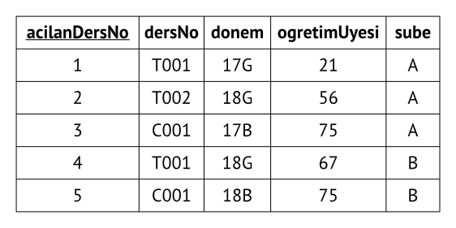

* **İlişkisel Veritabanı (Relational Database):** İlişkiler (tablolar) kümesi. Satır ve sütunlardan meydana gelen tablolar topluluğu.
* **İlişkisel Şema (Relational Schema):** İlişkinin (tablonun) adını ve ek olarak her bir sütunun adını ve tipini belirtir. Metin ile ifade edilebileceği gibi diyagram kullanılarak da gösterilebilir. 
  + Örneğin Ogrenciler isminde bir ilişkinin (tablonun) ilişkisel şeması aşağıda verilmiştir.
  + Ogrenciler(ogrenciNo: string, adi: string, soyadi: string, yas: integer, ortalama: real)
  
## Tablo

### Tablo Karakteristikleri
  
* Bir tablo (table), satır (row) ve sütunlardan (column) oluşan iki boyutlu bir yapı olarak algılanır.
* Her tablo satırı (kayıt/tuple), varlık kümesi (entity set) içerisindeki tek bir varlık (entity) oluşumunu temsil eder.
* Her tablo sütunu bir niteliği (attribute) temsil eder ve her bir sütun farklı bir isme sahiptir.
* Her satır-sütun kesişimi tek bir veri değerini temsil eder.
* Bir sütun içerisinde yer alan tüm değerler aynı veri tipine sahip olmalıdır.
* Her sütun, nitelik değer alanı (attribute domain) olarak bilinen kesin bir değerler aralığına sahiptir.
* Satır ve sütunların sırası Veritabanı Yönetim Sistemi (VTYS/DBMS) tarafından bakıldığında önemsizdir.
* Her tablo, her bir satırını eşsiz bir şekilde tanımlayan bir niteliğe veya nitelik birleşimine sahip olmak zorundadır. Buna birincil anahtar ismi verilir.

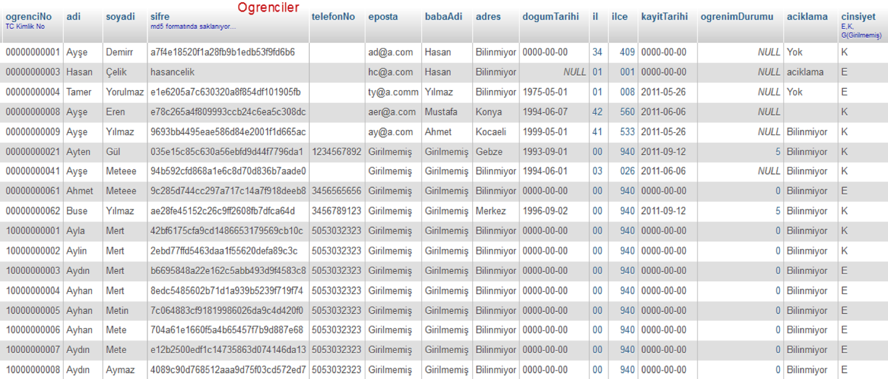

* Ogrenciler tablosu, 17 satır (kayıt) ve 15 sütundan (nitelik) oluşan bir iki boyutlu yapı olarak görülür.
* Ogrenciler tablosundaki her satır, varlık kümesindeki bir varlığı tanımlar (Varlık kümesi, Ogrenciler tablosu ile temsil edilir).
  + Örneğin 1. satır, Ayşe Demir ismindeki bir öğrenciyi tanımlar.
* Her sütun, bir niteliği temsil eder ve her sütunun ayrı bir ismi mevcuttur.
* Bir sütundaki tüm değerler, niteliğin karakteristikleri ile uyumludur.
  + Örneğin, dogumTarihi sütunu, tüm satırlar için doğum tarihi bilgilerini içerir.
* Veriler, biçimine ve fonksiyonuna göre sınıflandırılmalıdır. VTYS’lerin desteklediği temel veri tipleri:
  + Nümerik (Numeric): Üzerinde anlamlı aritmetik işlemler yapılabilen veri. Örneğin not ortalamasının saklandığı bir alan nümerik tiptedir.
  + Karakter (Character): Metin verisi, karakter dizisi. Aritmetik işlemler için tanımlanmamış olan karakter ve semboller. Örneğin adı, soyadı, telefon numarası vb. bilgilerin saklandığı alanlar.
  + Tarih (Date): Tarih verisi. Sezar tarihi (Julian date) formatında takvim tarihlerini ihtiva eden veridir. Örneğin doğum tarihi, bilgisinin saklandığı alan tarih tipindedir.
  + Mantıksal (Logical): Doğru ya da yanlış (evet veya hayır) değerleri.
* Bir sütun için izin verilen değerler aralığına, o sütunun değer alanı (domain) adı verilir.
  + Örneğin tablodaki öğrenci not bilgileri 0-4 aralığında sınırlandırılmış olduğundan ötürü, bu sütunun değer aralığı [0,4] olarak ifade edilir.
* ogrenciNo alanı birincil anahtardır.

## Anahtar

### Fonksiyonel Bağımlılık 

* **Anahtar:** Kayıtların ayırt edilebilmesini (süper, aday, birincil, ikincil ve vekil anahtarlar) ve/veya tablolar arasında ilişki kurulabilmesini (birincil, yabancı anahtarlar) sağlayan yapı.
* Anahtarlar belirlenirken **fonksiyonel bağımlılık** kavramının bilinmesi gerekir.
* Örnekte, ogenciNo alanı kullanılarak öğrenci adı belirlenebilir. Tersi doğru değildir.
* Bu durumda:
  + ogrenciNo alanı, ogrenciAdi alanını belirler.
  + ogrenciAdi alanı, ogrenciNo alanına **fonksiyonel bağımlıdır**.
  + ogrenciNo → ogrenciAdi şeklinde gösterilir.

### Anahtar Çeşitleri

* **Süper Anahtar:** Herbir satırı eşsiz olarak tanımlayabilen anahtara süper anahtar denir. Bir ya da birden çok alanı içerebilir.
  + ogrenciNo
  + ogrenciNo, adi
  + ogrenciNo, adi, soyadi , ...
* **Aday Anahtar:** Herbir satırı eşsiz olarak tanımlayabilen ve en az sayıda alana sahip olan süper anahtara aday anahtar denir.
  + “ogrenciNo, adi” ikilisi süper anahtardır. Sadece ogrenciNo alanı kayıtları eşsiz olarak tanımlayabildiğinden dolayı bu ikili aday anahtar değildir.
* **Birincil Anahtar (Primary Key, PK):** Herbir satırı eşsiz olarak tanımlayabilen ve aday anahtarlar içerisinden seçilen anahtar.
  + Birincil anahtar eşsiz değerlere sahip olmalıdır, NULL değerler alamaz.
  + ogrenciNo, kimlikNo, pasaportNo alanları aday anahtarlardır. Her biri birincil anahtar olarak seçilebilir (sadece biri seçilmelidir).
* **Vekil Birincil Anahtar:**
  + Uygulamada çoğunlukla vekil birincil anahtarlar kullanılır. Ayrıntılar "Vekil Birincil Anahtar" başlıklı bölümde verilmektedir.
* **İkincil/Alternatif Anahtar:** Birincil anahtar olarak seçilmeyen diğer aday anahtarlara ikincil/alternatif anahtar denir.
* **Yabancı Anahtar (Foreign Key, FK):** Bağıntı kurulan tablo içerisinde yer alan ve bağıntı kuran tablodaki birincil anahtarın değerlerine benzeyen değerler içeren alan.
  + İki tablo arasında bağıntı kurulurken bağıntı kuran tablonun birincil anahtarı ile bağıntı kurulan tablonun yabancı anahtarı kullanılır. Dolayısıyla iki anahtar da aynı tipte olmalıdır.
* Aşağıda yabancı anahtar örneği görülmektedir.

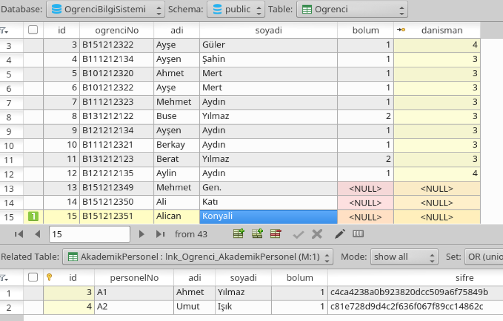
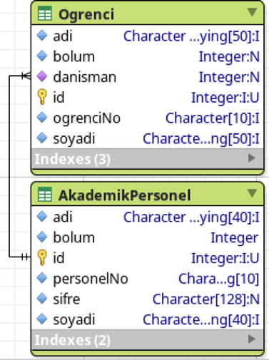

## Bütünlük Kuralları

* **Varlık Bütünlüğü (Entity Integrity):** Varlık bütünlüğünün sağlanabilmesi için her tabloda birincil anahtar (PK) olmalıdır.
  + Her varlığın "not null" kısıtını sağlayan eşsiz ("unique" kısıtı) bir tanımlayıcısı olması garanti edilir.
  + Varlık bütünlüğü kullanılarak, örneğin; aynı öğrenci numarasına sahip çok sayıda öğrencinin ya da öğrenci numarası olmayan öğrencinin bulunamaması garanti edilir.
* **Referans Bütünlüğü (Referential Integrity):** Referans bütünlüğünün sağlanabilmesi için yabancı anahtar(FK)tanımlanır.
  + Yabancı anahtar alanı ya NULL olabilir ya da bağıntı kuran tablodaki birincil anahtar alanı değerlerinden biri olabilir.
  + Her yabancı anahtar değerinin diğer tablonun birincil anahtarı değeriyle tutarlı olması garanti edilir.
  + Referans bütünlüğü kullanılarak, örneğin; öğrencinin açılmayan bir dersi alması, derse kayıtlı bir öğrencinin okuldan kaydının silinmesi, olmayan bir ürünün sipariş edilmesi vs. önlenir.
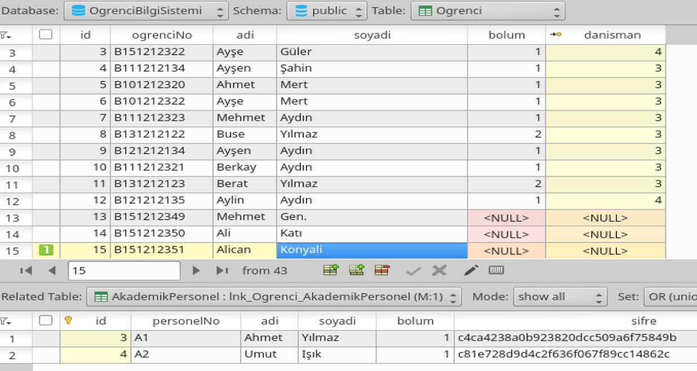
  + **Referans Bütünlüğü Uygulama Notu**
     + Referans bütünlüğünün sağlanması için yabancı anahtar alanının NULL olabileceği de söylenmişti.
     + NULL değer sorgularda sorunlara neden olabileceğinden genellikle NULL değer yerine özel değerler tercih edilir.
     + Örneğin; il bilgisi olarak NULL yerine “00: Bilinmiyor” verilebilir. Bu durumda İller tablosunda 00, Bilinmiyor değerlerine sahip bir satır bulunmalıdır. Kisiler tablosundaki il alanının varsayılan değeri de 00 yapılabilir. Böylece, kişinin il bilgisi girilmediği zaman varsayılan olarak bilinmiyor bilgisi atanmış olur.

* **NOT NULL (Boş Olamaz):** Alan içerisine değer yazılmasını zorlamak istiyorsak NOT NULL yapabiliriz. Örneğin, kişinin adının zorunlu olarak girilmesini bu şekilde sağlatabiliriz.
* **UNIQUE (Eşsiz):** Alan içerisine yazılan değerlerin her satır için eşsiz olmasını istiyorsak kullanılır. Örneğin, kişilerin TC Kimlik numaralarının aynı yazılamamasını bu şekilde garanti etmiş oluruz.

## Birincil Anahtar Özellikleri

* UNIQUE (kayıtları eşsiz olarak tanımlayabilmesi) ve NOT NULL (boş olmaması) bütünlük kurallarını sağlamalı.
* Anlamsal içeriğe (semantic meaning) sahip alanlar tercih edilmemeli.
  + Zamanla değişme ihtimali.
* Mümkün olduğunca tek bir alandan oluşmalı.
  + Çok alandan oluşursa bağıntıları kurmak ve sorguları yazmak zor olur.
* Sayısal alanlar tercih edilmeli.
  + İşlem hızı, otomatik artma (auto increment) desteğinden ötürü önemli.
* Güvenlik riski bulunan alanlar tercih edilmemeli.
  + Yazılımlarda yoğun olarak birincil anahtar değeri kullanılır.

## Vekil Birincil Anahtar

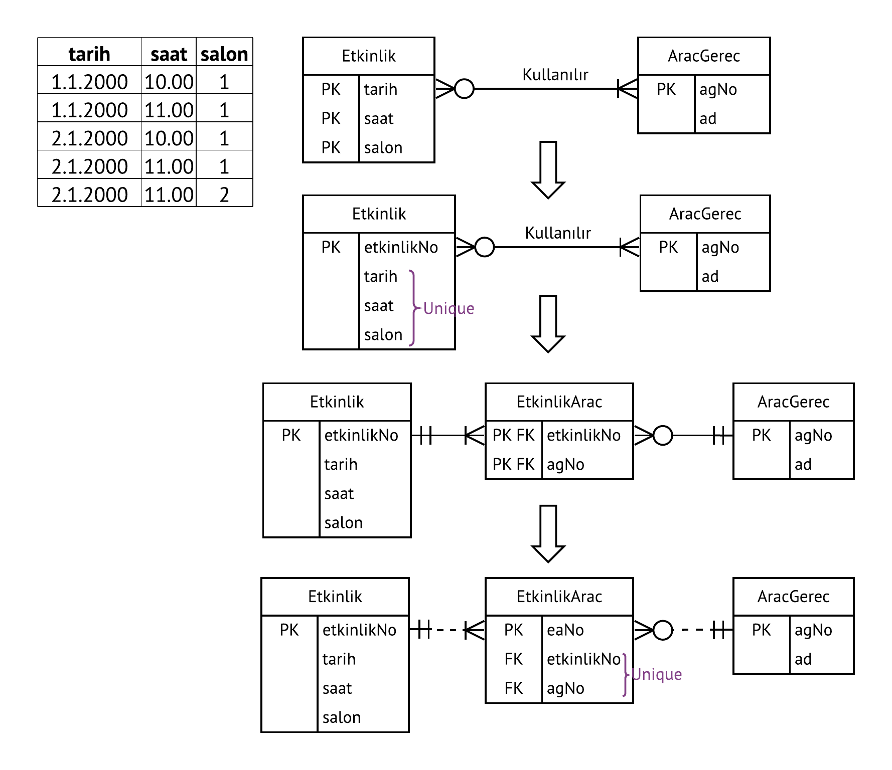

## Varlık Bağıntı Modelinin İlişkisel Modele Dönüştürülmesi

* Her varlık için bir tablo (ilişki/relation) oluşturulur.

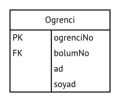

* **İlişkisel Şema**
  + Ogrenci(**ogrenciNo: String**, bolumNo: Integer, adi: String, soyadi: String)
   
### Bir-Bir Bağıntısı

* 1 öğretim üyesi 1 bölüm yönetebilir.
*	1 bölüm yalnızca 1 öğretim üyesi tarafından yönetilebilir.

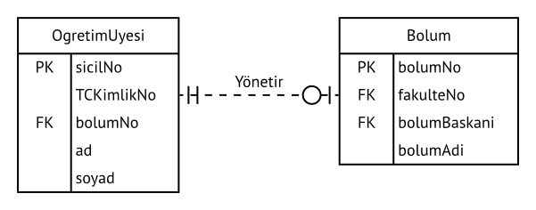

* Yalnızca 1 tarafının (en az 1 - en çok 1) varlığının (OgretimUyesi) birincil anahtarı (sicilNo) diğer varlığa yabancı anahtar alan (bolumBaskani) olarak eklenir.

* **İlişkisel Şema**

  + OgretimUyesi(**sicilNo: String**, TCKimlikNo: Char(11), bolumNo: Integer, ad: String, soyad: String)
  + Bolum(**bolumNo: Integer**, fakulteNo: Integer, bolumBaskani: String, bolumAdi: String)

### Bir-Çok Bağıntısı

*	1 derslik 1 binada bulunur.
*	1 binada çok derslik bulunur.

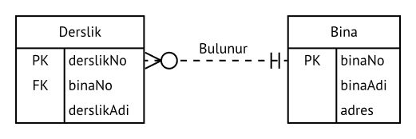

* 1 tarafının varlığının (Bina) birincil anahtarı (binaNo) diğer varlığa yabancı anahtar alan (binaNo) olarak eklenir

* **İlişkisel Şema**
  + Derslik(**derslikNo: Integer**, binaNo: Integer, derslikAdi: String)
  + Bina(**binaNo: Integer**, binaAdi: String, adres: String)
 
### Bir-Çok Bağıntısı / Varolma Bağımlılığı

* 1 apartmanda çok sayıda daire bulunur. En az bir daire bulunmak zorundadır.
* 1 daire yalnızca bir apartmanda (en az 1 – en çok 1) bulunmak zorundadır.

* 1 tarafının varlığının (Apartman) birincil anahtarı (apartmanNo) diğer varlığa hem yabancı anahtar hem de birincil anahtarın parçası (apartmanNo) olarak eklenir.
* **İlişkisel Şema**
  + Apartman(**apartmanNo: Integer**, apartmanAdi: String, adres: String)
  + Daire(**daireNo: Integer**, **apartmanNo: Integer**, daireAdi: String)

### Çok-Çok Bağıntısı

* 1 öğrenci çok sayıda derse kayıt yaptırabilir.
*	1 ders çok sayıda öğrenci tarafından alınabilir.

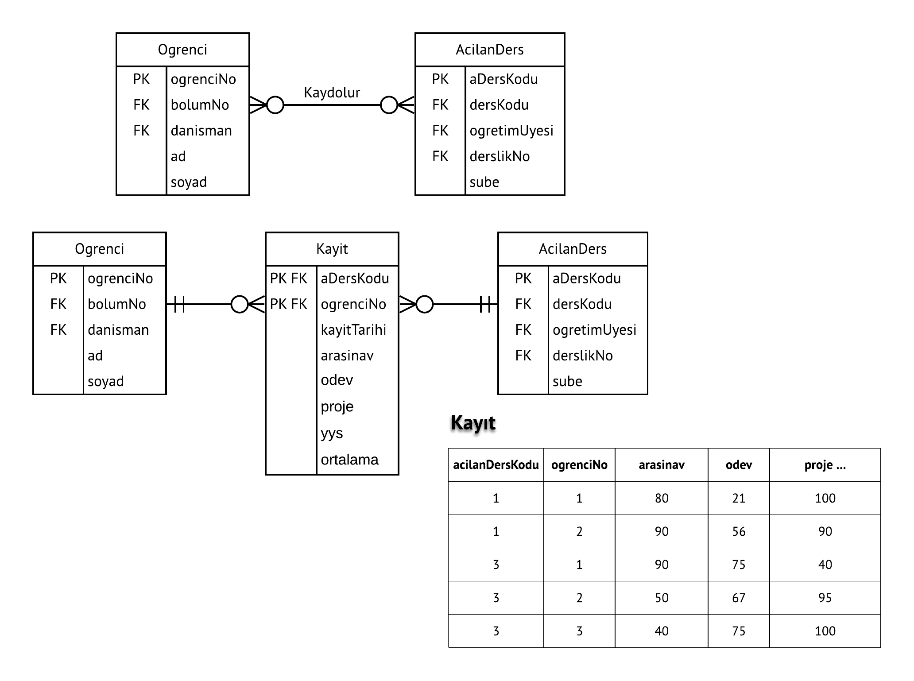

* **İlişkisel Şema**
  + Ogrenci(**ogrenciNo: String**, bolumNo: Integer, danisman: String, ad: String, soyad: String)
  + Kayit(**aDersKodu: String**, **ogrenciNo: String**, kayitTarihi: Date, not: Float)
  + AcilanDers(**aDersKodu: String**, dersKodu: String, ogretimUyesi: String, derslikNo: Integer, sube: Char(1))

### Tekli Bağıntı

* 1 personele 1 personel liderlik yapar.
* 1 personel çok  sayıda personele liderlik yapar.

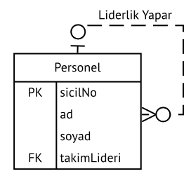

* **İlişkisel Şema**
  + Personel(**sicilNo: String**, ad: String, soyad: String, takimLideri: String)
  
## İndeks

* **İndeks:** Arama, listeleme işlemlerini hızlandırmak için kullanılan nesne.
* Aranan bilginin konumunun, anahtar değerinden yararlanılarak bulunabilmesini sağlar.
* Bir indeks, diğer indeksleri etkilemeksizin yok edilebilir ya da oluşturulabilir.
* Genelde aramaların sık yapıldığı özellikler indeks yapılır.
* İndeks alanlarla yapılan aramalar çok hızlı olurken kayıt ekleme ve silme (INSERT, DELETE) işlemleri nispeten yavaş olur.
* İndeks alanlar sıralı olarak listelenir.
* Birincil anahtar (primary key) alanlar otomatik olarak eşsiz indeks (unique index) olurlar.
* Bir tabloda çok sayıda indeks tanımlanabilir. Her indeks yalnızca bir tabloya ait olabilir.
* Birden fazla alan beraber indeks olarak tanımlanabilir.

## Veri Sözlüğü (Sistem Kataloğu)

* **Veri Sözlüğü (Sistem Kataloğu):** Üst verilerin (metadata) saklandığı veritabanıdır.
* Veritabanı Yönetim Sistemi tarafından yönetilir.
* Oluşturulan tüm veritabanlarına ait üst veriler (tablolar, tablo alanları, alan tipleri, değer aralıkları, anahtarlar, indeksler, bağıntılar, kısıtlar vb.) burada saklanır.
* Kullanıcı tarafından sorgulanabilir.

## Örnek Uygulama - Araç Üreticisi

### Senaryo

Bir araç üreticisi, farklı modellerde araçlar üretmektedir. Ürettiği araçlar, araçlarda kullanılan malzemeler, tedarikçiler vb. bilgilerini saklamak ve yönetmek istediği bir yazılım sistemi talep etmektedir.

### İş Kuralları

* Üretilen her bir aracın şasi numarası, renk, tür (otomobil, kamyon, minibüs vb.), model ve üretim tarihi bilgileri mevcuttur. Araçlar birbirinden şasi numarası ile ayırt edililir.
* Araç türlerinin kodu ve adı bilgileri mevcuttur.
* Araç modellerinin kodu, adı, ağırlık ve yolcu sayısı bilgileri mevcuttur.
* Araçlar farklı miktarda ve farklı türlerde malzemelerden üretilir. Bu bilgiler de kaydedilmelidir.
* Malzemeler tedarikçi şirketlerden satın alınmaktadır.
* Malzemelerin kodu, adı, stok miktarı bilgileri mevcuttur.
* Tedarikçi şirketlerin kodu, adı, vergi dairesi, vergi numarası bilgileri mevcuttur.
* Bir tedarikçi hiçbir malzeme tedarik etmeyebileceği gibi bir veya daha fazla malzeme de tedarik edebilir. Bir malzeme yalnızca bir tedarikçi tarafından temin edilir.
* Bir araç çok sayıda malzemeden oluşur. En az bir adet malzemeden oluşmak zorundadır. Bir malzeme birden fazla araçta kullanılabilir. Ancak henüz hiçbir araçta kullanılmamış da olabilir.
* Bir araç yalnızca bir türe sahip olur. Bir türe ait hiçbir araç olmayabileceği gibi çok sayıda araç da olabilir.
* Bir araç yalnızca bir modele sahip olur. Bir modele ait hiçbir araç olmayabileceği gibi çok sayıda araç da olabilir.

### Varlık Bağıntı Diyagramı

### İlişkisel Şema

* Arac(**sasiNo:char**, renk: varchar, modelKodu: char, turKodu: char, uretimTarihi: date)
* AracMalzeme(**sasiNo: char**, **malzemeKodu: char**, miktar: int)
* Malzeme(**malzemeKodu: char**, adi: varchar, stokMiktari: int, tedarikciKodu: char)
* Tur(**turKodu: char**, ad: varchar)
* Model(**modelKodu: char**, ad: varchar, agirlik: real, yolcuSayisi: int)
* Tedarikci(**tedarikciKodu: char**, ad: varchar, vergiDairesi: varchar, vergiNo: char)

## Örnek Uygulama – Elektronik Ticaret Sistemi

### Senaryo

Bir elektronik ticaret şirketi geliştirlecek olan bir elektronik ticaret sistemi için bir veritabanı tasarlanması isteniyor. Tasarlanan veritabanında müşteriler, ürünler, siparişler, faturalar, satış temsilcileri vb. bilgilerin saklanması beklenmektedir.

### İş Kuralları

* Bu veritabanında her müşteriye bir numara verilerek müşterinin TC Kimlik numarası, adı, soyadı, yaşadığı ili saklanması düşünülüyor.
* İllerin plaka numarası ve adı saklanır.
* Her siparişe bakan bir satış temsilcisi mevcuttur. Satış temsilcilerinin TCKimlikNo, ad ve soyad bilgileri mevcuttur.
* Ürünlerin (kişisel bilgisayar, telefon vb.) kodu, adı, fiyatı ve stok miktarlarının saklanması gerekmektedir.
* Ürünlerin kategorileri (bilgisayar, ev elektroniği, kozmetik vb.) mevcuttur.
* Müşterilerin ürün siparişleri saklanarak her bir siparişe bir fatura kesilmesi sağlanmalıdır.
* Her siparişin eşsiz bir sipariş numarası ve sipariş tarihi mevcuttur.
* Sipariş edilen bir ürünün sipariş adedi ve birim fiyatı (kişiye özel indirim v.s. nedeniyle ürün tablosundaki fiyattan farklılık gösterebilir) da kaydedilmelidir.
* Faturaların fatura numarası, tarih ve  fatura adresi  bilgileri saklanmalıdır. (Toplam fiyat hesaplanabilir ya da saklanabilir).
* Siparişler bir kargo firması tarafından iletilir. Kargo firmasının kodu, adı, adresi bilgileri yer alır. Her kargo firmasında siparişlerden sorumlu bir yetkili yer alır.
* Bir ürünün yalnızca bir kategorisi mevcuttur. Bir kategori çok sayıda ürünün kategorisi olabilir.
* Bir siparişte en az bir ürün bulunur. Ancak çok sayıda ürün de bulunabilir. Bir ürün çok sayıda siparişte yer alabilir.
* Bir müşteri çok sayıda sipariş verebilir. Bir sipariş yalnızca bir müşteri tarafından verilebilir.
* Bir siparişin yalnızca bir faturası olabilir. Bir fatura yalnızca bir siparişin faturası olabilir.
* Bir sipariş ile yalnızca bir satış temsilcisi ilgilenir. Bir satış temsilcisi çok sayıda sipariş ile ilgilenebilir.
* Bir müşteri yalnızca bir ilde yaşayabilir. Bir ilde çok sayıda müşteri yaşayabilir.
* Bir sipariş yalnızca bir kargo firması tarafından iletilir. Bir kargo firması çok sayıda sipariş iletebilir.

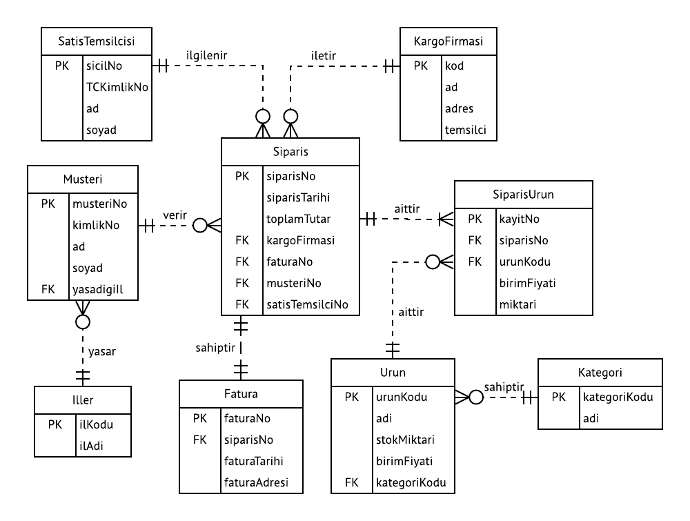

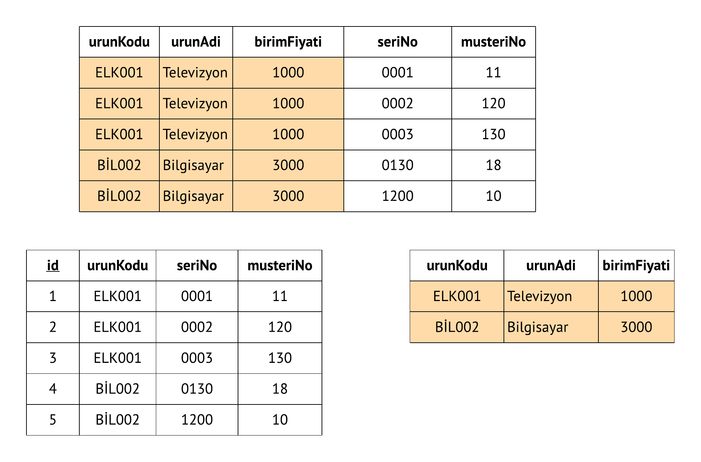

### İlişkisel Şema

* SatisTemsilcisi(**sicilNo: char**, TCKimlikNo: char, ad: varchar, soyad: varchar)
* KargoFirması(**kod: char**, ad: varchar, adres: varchar, temsilci: varchar)
* Musteri(**musteriNo: char**, TCKimlikNo: char, ad: varchar, soyad: varchar, yasadıgıIl: varchar)
* Siparis(**siparisNo: char**, siparisTarihi: date, toplamTutar: real, kargoFirması: char, faturaNo: char, musteriNo: char, satisTemsilciNo: char)
* SiparisUrun(**kayitNo: int**, siparisNo: char, urunKodu: char, birimFiyati: real, miktar: int)
* Kategori(**kategoriKodu: char**, adi: varchar)
* İller(**plakaNo: varchar**, ilAdi: varchar)
* Fatura(**faturaNo: char**, tarih: date)
* Urun(**urunKodu: char**, adi: varchar, stokMiktari: int, birimFiyati: real, kategoriKodu: char)

## Kaynaklar

* Carlos Coronel, Steven Morris, and Peter Rob, Database Systems: Design, Implementation, and Management, Cengage Learning.

