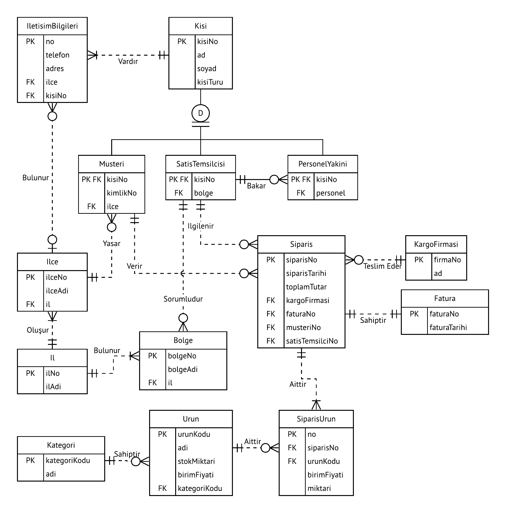

BSM211 Veritabanı Yönetim Sistemleri - Celal ÇEKEN, İsmail ÖZTEL, Veysel Harun ŞAHİN

# Genişletilmiş Varlık Bağıntı Modeli

## Konular

* Genelleme (Kalıtım)
  + Çakışan/Overlap
  + Ayrık/Disjoint
  + Kısmi Bütünlük/Partial Completeness
  + Toplam Bütünlük/Total Completeness
* Kümeleme

## Genelleme (Kalıtım)

* Bir veritabanı içerisinde benzer özelliklere sahip varlıklar için ortak alanları içeren temel bir varlık oluşturulabilir ve diğer varlıklar bu temel varlıktan türetilebilir.
* Bunun çeşitli avantajları vardır.
  * Değişikliklerin kolay yapılabilmesi
  * Hızlı tasarım
  * Anlaşılabilirliğin artması vb.
* NYP paradigmasındaki kalıtım özelliğine benzer.

### Temel Kavramlar

* **Çakışan (Overlap)**
  * **Gösterim: O**
  * Aynı temel varlıkla ilgili birden fazla çocuk varlık olabilir.
  * Örneğin öğrenci bilgi sistemindeki bir kişinin hem personel hem de öğrenci olabilmesi.
* **Ayrık (Disjoint)**
  * **Gösterim: D**
  * Aynı temel varlıkla ilgili tek bir çocuk varlık olabilir.
  * Örneğin e-ticaret uygulamasındaki bir kişinin ya müşteri ya da personel olabilmesi, her ikisi birden olamaması.
* **Kısmi Bütünlük (Partial Completeness) 
  * **Gösterim: Tek Çizgi:** 
  * Üst tip (supertype) kayıtlar, alt tip (subtype) kayıtlar olmadan da mevcut olabilir.
* **Toplam Bütünlük (Total Completeness) 
  * **Gösterim: Çift Çizgi**
  * Her üst tip (supertype) kaydın, mutlaka en az bir alt tip (subtype) kaydı olmalı.

### Örnek 1

### Örnek 2

### Örnek 3

## Kümeleme

* VB diyagramlarını basitleştirmek ve okunabilirliğini artırmak için, çok sayıda varlık ve bağıntıları yerine sanal varlık kullanılamsı işine kümeleme denir.

## Kaynaklar

* Carlos Coronel, Steven Morris, and Peter Rob, Database Systems: Design, Implementation, and 	Management, Cengage Learning.
