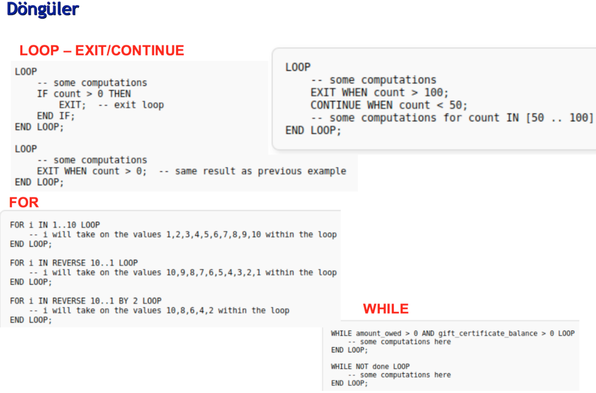
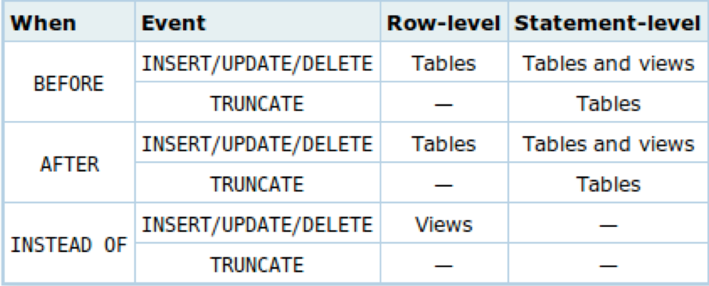

BSM211 Veritabanı Yönetim Sistemleri - Celal ÇEKEN, İsmail ÖZTEL, Veysel Harun ŞAHİN

# SQL Programlama: Fonksiyon/Saklı Yordam, Koşul İfadeleri, Döngü İfadeleri, İmleç (Cursor), Tetikleyici (Trigger), Hazır Fonksiyonlar

## Konular

* Fonksiyon (Function) / Saklı Yordam (Stored Procedure)
* Koşul İfadeleri, Döngü İfadeleri
* İmleç (Cursor)
* Tetikleyici (Trigger)
* Hazır Fonksiyonlar

> Pagila örnek veritabanını kullanmaktadır. (VB Diyagramı: https://dataedo.com/samples/html/Pagila/doc/Pagila_10/modules/Paglia_database_diagram_103/module.html)

## Fonksiyon (Function) / Saklı Yordam (Stored Procedure)

* Fonksiyonlar / saklı yordamlar, sistem kataloğunda saklanan SQL ifadeleridir. Fonksiyonlar / saklı yordamlar; uygulama yazılımları, tetikleyici ya da başka bir fonksiyon / saklı yordam tarafından çağrılabilirler.

### Avantajları
Web Uygulama Mimarısı.

* Uygulamanın başarımını iyileştirir. 
  + Fonksiyonlar / saklı yordamlar, bir defa oluşturulduktan sonra derlenerek sistem kataloğunda saklanır. Her çağrıldıklarında SQL motoru tarafından derlenmek zorunda olan SQL ifadelerine göre çok daha hızlıdır. 

* Uygulama ile veritabanı sunucusu arasındaki trafiği azaltır.
  + Uzun SQL ifadeleri yerine fonksiyonun / saklı yordamın adını ve parametrelerini göndermek yeterlidir. Ara sonuçların istemci ve sunucu arasında gönderilmesi önlenir.

* Yeniden kullanılabilir (reusable).
  + Tasarım ve uygulama geliştirme sürecini hızlandırır.

* Güvenliğin sağlanması açısından çok kullanışlıdır. 
  + Veritabanı yöneticisi, fonksiyonlara / saklı yordamlara hangi uygulamalar tarafından erişileceğini, tabloların güvenlik düzeyleriyle uğraşmadan, kolayca belirleyebilir.

### Dezavantajları

* Uygulamanın iş mantığı veritabanı sunucusuna kaydırıldığı için uygulama ile veritabanı arasındaki bağımlılık artar ve veritabanından bağımsız kodlama yapmak gitgide imkansızlaşır.

* Veritabanı tasarımının anlaşılabilirliğini düşürür. 
  + Görünür veritabanı yapısının arkasında, ilişkileri kolayca anlaşılayamayan başka bir yapı oluştururlar.

* Fonksiyon / saklı yordam ile program yazmak, değiştirmek (sürüm kontrolü) ve hata bulmak zordur.

* Veritabanı Yönetim Sistemi, veri depolama ve listeleme işlerine ek olarak farklı işler yapmak zorunda da kalacağı için bellek kullanımı ve işlem zamanı açısından olumsuz sonuçlara neden olabilir.

* Fonksiyonların / saklı yordamların yapacağı işler uygulama yazılımlarına da yaptırılabilir.

## Fonksiyon Örneği 1 

~~~sql
CREATE OR REPLACE FUNCTION inch2m(sayiInch REAL)
RETURNS REAL
AS
$$ -- Fonksiyon govdesinin (tanımının) başlangıcı
BEGIN
    RETURN 2.54 * sayiINCH / 100;
END;
$$ -- Fonksiyon govdesinin (tanımının) sonu
LANGUAGE plpgsql;
~~~

* Fonksiyon çağrısı

~~~sql
SELECT * FROM inch2m(10);
~~~

## Koşul İfadeleri

~~~sql
IF miktar > 0 THEN
    ...
ELSE
    ...
END IF;
~~~

~~~sql
IF miktar < 100 THEN
    ...
ELSEIF miktar >= 100 AND miktar < 200 THEN
    ...
ELSEIF miktar >= 200 AND miktar < 300 THEN
    ...
ELSE
    ...
END IF;
~~~

~~~sql
CASE
    WHEN sonuc > 0 THEN
        ...
    WHEN sonuc < 0 THEN
        ...
    ELSE
        ...
END CASE;
~~~

~~~sql
CASE sonuc
    WHEN 0 THEN
        ...
    WHEN 1 THEN
        ...
    ELSE
        ...
END CASE;
~~~

* https://www.postgresql.org/docs/current/plpgsql-control-structures.html

## Fonksiyon Örneği 2 

~~~sql
CREATE OR REPLACE FUNCTION "fonksiyonTanimlama"(mesaj text, altKarakterSayisi SMALLINT, tekrarSayisi integer)
RETURNS TEXT -- SETOF TEXT, SETOF RECORD diyerek çok sayıda değerin döndürülmesi de mümkündür
AS  
$$
DECLARE
    sonuc TEXT; -- Değişken tanımlama bloğu
BEGIN
    sonuc := '';
    IF tekrarSayisi > 0 THEN
        FOR i IN 1 .. tekrarSayisi LOOP
            sonuc := sonuc || i || '.' || SUBSTRING(mesaj FROM 1 FOR altKarakterSayisi) || E'\r\n';
            -- E: string içerisindeki (E)scape karakterleri için...
        END LOOP;
    END IF;
    RETURN sonuc;
END;
$$
LANGUAGE 'plpgsql' IMMUTABLE SECURITY DEFINER;
~~~

* IMMUTABLE: Aynı girişler için aynı çıkışları üretir. Böylece, fonksiyonun gövde kısmı bir kez çalıştırıldıktan sonra diğer çağrılarda çalıştırılmaz. Optimizasyon mümkün olabilir. 
* Varsayılan VOLATILE: Fonksiyon değeri değişebilir dolayısıyla optimizasyon yapılamaz.

* SECURITY DEFINER: Fonksiyon, oluşturan kullanıcının yetkileriyle çalıştırılır.
* Varsayılan SECURITY INVOKER: Fonksiyon, çağıran kullanıcının yetkileri ile çalıştırılır.

* Fonksiyon çağrısı

~~~sql
SELECT "fonksiyonTanimlama"('Deneme', 2::SMALLINT, 10);
~~~

## Dil Desteği Ekleme 

* Linux
* plperl diliyle program yazabilmek için plperl dil desteğini ekleme.
* BilgisayarAdi@KullaniciAdi:~$ sudo apt-get install postgresql-plperl-9.6 

* Application Stack Builder uygulaması mevcutsa bu uygulama aracılığı ile de EDB Language Pack yüklenerek ek dil paketleri eklenebilir.

* Dil paketi yüklendikten sonra dilin oluşturulması gerekir.

~~~sql
CREATE LANGUAGE "plperl";
~~~

* Ekli dilleri göster.

~~~sql
SELECT * FROM "pg_language";
~~~

* https://www.postgresql.org/docs/current/catalog-pg-language.html

## Fonksiyon Örneği 3

* plperl dili ile örnek bir fonksiyon örneği aşağıda görülmektedir.

~~~sql
CREATE FUNCTION "kucukOlaniDondur" (INT, INT)
RETURNS INTEGER 
AS
$$
    if ($_[0] > $_[1]) 
    { 
		return $_[1]; 
    }
    return $_[0];
$$
LANGUAGE "plperl";
~~~

* Fonksiyon çağrısı
~~~sql
SELECT "kucukOlaniDondur"(12,6)
~~~

## Fonksiyon Örneği 4 

* Bir SELECT sorgusunun sonuç kümesi içerisinde dolanımın nasıl yapılacağını gösteren fonksiyon örneği aşağıda gösterilmektedir.

~~~sql
CREATE OR REPLACE FUNCTION kayitDolanimi()
RETURNS TEXT
AS
$$
DECLARE
    musteriler customer%ROWTYPE; -- customer."CustomerID"%TYPE
    sonuc TEXT;
BEGIN
    sonuc := '';
    FOR musteriler IN SELECT * FROM customer LOOP
        sonuc := sonuc || musteriler."customer_id" || E'\t' || musteriler."first_name" || E'\r\n';
    END LOOP;
    RETURN sonuc;
END;
$$
LANGUAGE 'plpgsql';
~~~

* Fonksiyon çağrısı

~~~sql
SELECT  kayitDolanimi();
~~~

## Fonksiyon Örneği 5 

* Tablo döndüren fonksiyon örneği aşağıdadır.

~~~sql
CREATE OR REPLACE FUNCTION personelAra(personelNo INT)
RETURNS TABLE(numara INT, adi VARCHAR(40), soyadi VARCHAR(40)) 
AS 
$$
BEGIN
    RETURN QUERY SELECT "staff_id", "first_name", "last_name" FROM staff
                 WHERE "staff_id" = personelNo;
END;
$$
LANGUAGE "plpgsql";
~~~

* Fonksiyon çağrısı

~~~sql
SELECT * FROM personelAra(1);
~~~

## Fonksiyon Örneği 6 

* Fonksiyon içerisinden fonksiyon çağırma örneği aşağıdadır.

~~~sql
CREATE OR REPLACE FUNCTION public.odemetoplami(personelno INTEGER)
RETURNS TEXT
LANGUAGE "plpgsql"
AS
$$
DECLARE
    personel RECORD;
    miktar NUMERIC;
BEGIN
    personel := personelAra(personelNo);
    miktar := (SELECT SUM(amount) FROM payment WHERE staff_id = personelNo); 

    RETURN personel."numara" || E'\t' || personel."adi" || E'\t' || miktar;
END
$$;
~~~

* Fonksiyon çağrısı

~~~sql
SELECT odemeToplami(2);
~~~

## Fonksiyon Örneği 7

* Argüman listesinde çıkış parametresi tanımlanan fonksiyon örneği aşağıdadır.

~~~sql
CREATE OR REPLACE FUNCTION inch2cm(sayiInch REAL, OUT sayiCM REAL)
AS 
$$
BEGIN
    sayiCM := 2.54 * sayiINCH;
END;
$$
LANGUAGE "plpgsql";
~~~

* Fonksiyon çağrısı

~~~sql
SELECT * FROM inch2cm(2);
~~~

## İmleç (Cursor)

* İmleç (cursor), sorgu sonucunun toplu olarak oluşturulması yerine parça parça (satır satır) oluşturulmasını sağlar.

* LIMIT ve OFFSET yapılarının da benzer bir işi yaptığını hatırlayınız.

* Yük dengeleme, uygulama sunucusunun, veritabanı sunucusunun ve istemci belleğinin verimli kullanımı vb. amaçlar için kullanılabilir.

## İmleç Örneği

~~~sql
CREATE OR REPLACE FUNCTION filmAra(yapimYili INTEGER, filmAdi TEXT)
RETURNS TEXT
AS
$$
DECLARE
    filmAdlari TEXT DEFAULT '';
    film RECORD;
    filmImleci CURSOR(yapimYili INTEGER) FOR SELECT * FROM film WHERE release_year = yapimYili;
BEGIN
   OPEN filmImleci(yapimYili);
   LOOP
      FETCH filmImleci INTO film;
      EXIT WHEN NOT FOUND;
      IF film.title LIKE filmAdi || '%' THEN
          filmAdlari := filmAdlari || film.title || ':' || film.release_year|| E'\r\n';
      END IF;
   END LOOP;
   CLOSE filmImleci;

   RETURN filmAdlari;
END;
$$
LANGUAGE 'plpgsql';
~~~

* Fonksiyon çağrısı

~~~sql
SELECT * FROM filmAra(2006, 'T');
~~~

## Tetikleyici (Trigger)

* https://www.postgresql.org/docs/current/sql-createtrigger.html

* INSERT, UPDATE ve DELETE (PostgreSQL'de TRUNCATE için de tanımlanabilir) işlemleri ile birlikte otomatik olarak çalıştırılabilen fonksiyonlardır.

### Avantajları

* Veri bütünlüğünün sağlanması için alternatif bir yoldur. (Örneğin; ürün satıldığında stok miktarının da azaltılması)

* Zamanlanmış görevler için alternatif bir yoldur. 
  + Görevler beklenmeden INSERT, UPDATE ve DELETE işlemlerinden önce ya da sonra otomatik olarak yerine getirilebilir.
  + Örneğin; kaydı silinen müşteriyi, "EskiMusteriler" tablosuna gönderme.

* Tablolardaki değişikliklerin günlüğünün tutulması (logging) işlemlerinde oldukça faydalıdır.
  + Örneğin; kişinin şifre değişikliğini log tablosuna gönder.

### Dezavantajları

* Veritabanı tasarımının anlaşılabilirliğini düşürür. 
  + Fonksiyonlarla / saklı yordamlarla birlikte görünür veritabanı yapısının arkasında başka bir yapı oluştururlar.

* Ek iş yükü oluştururlar ve dolayısıyla işlem gecikmeleri artabilir. 
  + Tablolarla ilgili her değişiklikte çalıştıkları için ek iş yükü oluştururlar ve bunun sonucu olarak işlem gecikmeleri artabilir.

### Tetikleyici Örneği

> NorthWind veritabanı kullanmaktadır.

* Ürünlerin birim fiyat değişimlerini izlemek için kullanılan bir tetikleyici örneği aşağıdadır.

~~~sql
CREATE TABLE "public"."UrunDegisikligiIzle" (
	"kayitNo" serial,
	"urunNo" SmallInt NOT NULL,
	"eskiBirimFiyat" Real NOT NULL,
	"yeniBirimFiyat" Real NOT NULL,
	"degisiklikTarihi" TIMESTAMP NOT NULL,
	CONSTRAINT "PK" PRIMARY KEY ("kayitNo")
);
~~~

~~~sql
CREATE OR REPLACE FUNCTION "urunDegisikligiTR1"()
RETURNS TRIGGER 
AS
$$
BEGIN
    IF NEW."UnitPrice" <> OLD."UnitPrice" THEN
        INSERT INTO "UrunDegisikligiIzle"("urunNo", "eskiBirimFiyat", "yeniBirimFiyat", "degisiklikTarihi")
        VALUES(OLD."ProductID", OLD."UnitPrice", NEW."UnitPrice", CURRENT_TIMESTAMP::TIMESTAMP);
    END IF;

    RETURN NEW;
END;
$$
LANGUAGE "plpgsql";
~~~

~~~sql
CREATE TRIGGER "urunBirimFiyatDegistiginde"
BEFORE UPDATE ON "products"
FOR EACH ROW
EXECUTE PROCEDURE "urunDegisikligiTR1"();
~~~

~~~sql
UPDATE "products"
SET "UnitPrice" = 100
WHERE "ProductID" = 4 
~~~

### Before İfadesi

* Ekleme ve güncelleme işleminde yeni verinin değiştirilebilmesini/denetimini sağlar

~~~sql
CREATE OR REPLACE FUNCTION "kayitEkleTR1"()
RETURNS TRIGGER 
AS
$$
BEGIN
    NEW."CompanyName" = UPPER(NEW."CompanyName"); -- büyük harfe dönüştürdükten sonra ekle
    NEW."ContactName" = LTRIM(NEW."ContactName"); -- Önceki ve sonraki boşlukları temizle
    IF NEW."City" IS NULL THEN
            RAISE EXCEPTION 'Sehir alanı boş olamaz';  
    END IF;
    RETURN NEW;
END;
$$
LANGUAGE "plpgsql";
~~~

~~~sql
CREATE TRIGGER "kayitKontrol"
BEFORE INSERT OR UPDATE ON "customers"  -- veriyi eklemeden/değiştirmeden önce üzerinde işlem yap
FOR EACH ROW
EXECUTE PROCEDURE "kayitEkleTR1"();
~~~

~~~sql
INSERT INTO "customers" ( "CustomerID","CompanyName", "ContactName") 
VALUES ( '45', 'Orka Ltd.', '    Ayşe Yalın     ' );
~~~

~~~sql
INSERT INTO "customers" ( "CustomerID","CompanyName", "ContactName","City") 
VALUES ( '45', 'Orka Ltd.', '    Ayşe Yalın     ', 'Sakarya' );
~~~

~~~sql
ALTER TABLE "products"
DISABLE TRIGGER "urunBirimFiyatDegistiginde";
~~~

~~~sql
ALTER TABLE "products"
ENABLE TRIGGER "urunBirimFiyatDegistiginde";
~~~

~~~sql
ALTER TABLE "products"
DISABLE TRIGGER ALL;
~~~

~~~sql
ALTER TABLE "products"
ENABLE TRIGGER ALL;
~~~

~~~sql
DROP TRIGGER "urunBirimFiyatDegistiginde" ON "products";
~~~

~~~sql
DROP TRIGGER IF EXISTS "urunBirimFiyatDegistiginde" ON "products";
~~~

## PostgreSQL Hazır Fonksiyonları

### Tarih ve Zaman Fonksiyonları

https://www.postgresql.org/docs/11/functions-datetime.html

> CURRENT_DATE

* O anki tarihi seç.

~~~sql
SELECT CURRENT_DATE; -- 2019-11-29
~~~

> CURRENT_TIME

* O anki zamanı seç.
* Zaman bölgesiyle birlikte.
~~~sql

SELECT CURRENT_TIME; -- 10:36:58.477505+03  
~~~

> LOCALTIME

* O anki zamanı seç. 
* Zaman bölgesi olmadan.

~~~sql
SELECT LOCALTIME;  -- 10:29:23.910726
~~~

> CURRENT_TIMESTAMP

* O anki tarih ve zamanı birlikte seç.
* TIMESTAMP: Tarih + Zaman
* Zaman bölgesi ile birlikte.

~~~sql
SELECT CURRENT_TIMESTAMP; -- 2019-11-29 10:32:45.738494+03
~~~

> NOW()

* O anki zamanı seç.
* CURRENT_TIMESTAMP ile aynı.

~~~sql  
SELECT NOW(); -- 2019-11-29 10:32:27.821435+03
~~~

> LOCALTIMESTAMP

* O anki tarih ve zamanı birlikte seç.
* TIMESTAMP: Tarih + Zaman
* Zaman bölgesi olmadan.

~~~sql
SELECT LOCALTIMESTAMP; -- 2019-11-29 10:33:16.82736
~~~

> AGE

* Aralıktaki zamanı döndür.

~~~sql
SELECT AGE(timestamp '2018-04-10', timestamp '1957-06-13'); -- 60 years 9 mons 27 days
~~~

* Verilen zamandan günümüze kadar olan zamanı döndür.
~~~sql
SELECT AGE(timestamp '2018-10-07 23:00:01'); -- 1 year 1 mon 21 days 00:59:59
~~~

* Verilen tarihten günümüze kadar olan zamanı döndür.
* Yaş hesapla.

~~~sql
SELECT AGE(timestamp '2000-10-07'); -- 19 years 1 mon 22 days
~~~

> DATE_PART() / EXTRACT()

* DATE_PART() ve EXTRACT() fonksiyonları, tarih/zaman'dan ya da zaman diliminden(interval) istenen bölümü almak için kullanılır.

~~~sql
SELECT DATE_PART('years', AGE(timestamp '2000-10-07'));
~~~

~~~sql
SELECT DATE_PART('day', INTERVAL '2 years 5 months 4 days'); 
~~~

~~~sql
SELECT EXTRACT(day from INTERVAL '2 years 5 months 4 days'); 
~~~

~~~sql
SELECT EXTRACT(hour from timestamp '2018-12-10 19:27:45');
~~~

> DATE_TRUNC

* Tarih-zaman bilgisini istenilen hassasiyette göstermek için kullanılır.

~~~sql
SELECT DATE_TRUNC('minute', timestamp '2018-10-07 23:05:40'); -- 2018-10-07 23:05:00
~~~

> JUSTIFY_DAYS

* Zaman aralığını 30 günlük periyotlara bölerek ifade et.

~~~sql
SELECT JUSTIFY_DAYS(interval '51 days');  -- 1 ay 21 gün
~~~

> JUSTIFY_HOURS

* Zaman aralığını 24 saatlik periyotlara bölerek ifade et.

~~~sql
SELECT JUSTIFY_HOURS(interval '27 hours'); -- 1 gün 03:00:00 
~~~

> JUSTIFY_INTERVAL

* Zaman aralığını hem JUSTIFY_DAYS hem de JUSTIFY_HOURS kullanarak işaretleri de dikkate alarak ifade et.

~~~sql  
SELECT JUSTIFY_INTERVAL(interval '1 mon -1 hour') -- 29 gün 23:00:00
~~~

> EXTRACT EPOCH

* UNIX zaman damgasının başından (1.1.1970'den) belli bri ana kadar geçen süre (sn. cinsinden).

* Şu ana kadar geçen süre.

~~~sql
SELECT EXTRACT(EPOCH FROM NOW()); -- 1575267225.07053
~~~

* Verilen zamana kadar geçen süre.

~~~sql
SELECT EXTRACT(EPOCH FROM TIMESTAMP WITH TIME ZONE '2018-12-10 20:38:40.12-08'); -- 982384720.12
~~~

> TO_TIMESTAMP

* Zaman damgasına dönüştürme.

* UNIX zamanının başlangıç değerini (epoch = 0) UNIX zaman damgasına dönüştür.

~~~sql
SELECT TO_TIMESTAMP(0); -- 1970-01-01 02:00:00+02
~~~

* Belli bir epoch değerini UNIX zaman damgasına dönüştür.
~~~sql
SELECT TO_TIMESTAMP(1544503120.12); -- 2018-12-11 07:38:40.12+03
~~~

> TO_CHAR

* Tarih zaman biçimlendirme.

~~~sql
SELECT TO_CHAR(current_timestamp, 'HH24:MI:SS:MS'); -- HH12, MS Milisecond, US microsecond
~~~
  
~~~sql
SELECT TO_CHAR(current_timestamp, 'DD/MM/YYYY');   -- YYYY year (4 basamak), YY, TZ	time zone
~~~

> Tarih zaman fonksiyonu kullanımı örneği

* Pagila veritabanından film kiralama sürelerinin bulunması

~~~sql
SELECT customer_id, to_char(rental_date, 'DD/MM/YYYY'  ), return_date,
         age(return_date, rental_date)
FROM rental
WHERE return_date IS NOT NULL
ORDER BY 3 DESC
~~~

### Matematiksel Fonksiyonlar 

* https://www.postgresql.org/docs/current/functions-math.html

### Karakter Katarı (String) Fonksiyonları

* https://www.postgresql.org/docs/current/functions-string.html

### Veri Tipi Biçimlendirme Fonksiyonları

* https://www.postgresql.org/docs/current/functions-formatting.html
