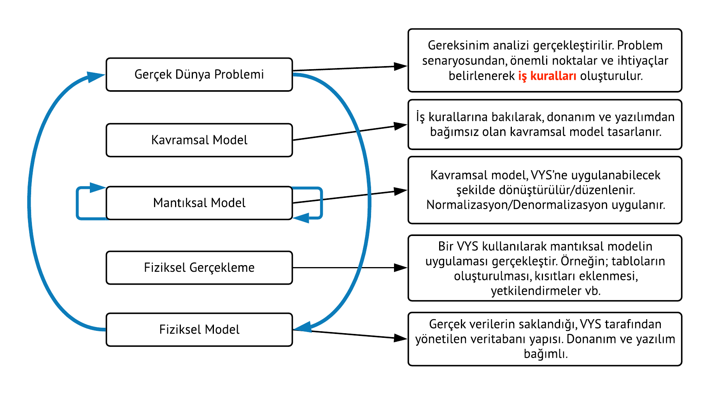

BSM211 Veritabanı Yönetim Sistemleri - Celal ÇEKEN, İsmail ÖZTEL, Veysel Harun ŞAHİN

# Normalizasyon

## Konular

* Normalizasyon
* Normalizasyon Neden Yararlıdır?
* Birinci Normal Form (1NF)
* Fonksiyonel Bağımlılık
* İkinci Normal Form (2NF)
* Üçüncü Normal Form (3NF)
* 1., 2. ve 3. Normal Formlar
* Örnekler
* Kaynaklar

## Veritabanı Geliştirme Yaşam Döngüsü

## Normalizasyon

* İyi bir veritabanı tasarımı, düzenli ve sağlam tablo tasarımlarını gerektirir.

* Normalizasyon, veri fazlalıklarını en aza indirerek veri düzensizliklerinin (data anomaly) önüne geçebilmek için tablo yapılarını değerlendirme ve düzeltme işlemi olarak tanımlanabilir.

* Normalizasyon işlemi normal form adı verilen seri işlemlerden meydana gelir. 1NF, 2NF, 3NF, 4NF

* 2NF 1NF den, 3NF 2NF den, ve 4NF 3NF den daha iyidir.

* Her tasarım için en yüksek NF daha iyi sonuç verir denemez. Yüksek başarıma ihtiyaç duyulan bazı durumlarda normal formun (NF) düşürülmesi (denormalizasyon) gerekebilir.

* Örneğin yüksek hız için veri fazlalığı göze alınarak zaman zaman denormalizasyon yapılabilir.

* Normalizasyonun en temel faydası, **veri tekrarını** en aza indirerek veri düzensizliklerinin (data anomaly) önüne geçmemize yardımcı olmasıdır.

## Veri Tekrarının Zararları

> Veri tekrarı tablo içerisine başka tablonun gömüldüğü anlamına gelir.

* Veri tekrarında aynı bilgi defalarca kaydedilir.

* Veri tekrarı, kaynak kullanımında israfa yol açar.

* Veri tekrarı, veri tutarsızlıklarına (düzensizliklerine) neden olabilir.
    + Veri girişinde tutarsızlık
    + Veri güncellenmesinde tutarsızlık
    + Veri silmede tutarsızlık

### Veri Girişinde Tutarsızlık

* Veri tekrarı olan tablolara yeni kayıt eklenirken tutarsızlıklar oluşabilir.

> Tabloya yeni kayıt eklenirken filmAdi ve izlenmeSayisi sütunlarında tutarsızlık oluşmuştur.

* Veri tekrarı olan tablolara birincil anahtar değerinin tekrar etmesi durumunda yeni kayıt eklenemeyebilir.

> Tabloda, oyuncuNo alanına değer yazılamaz ve 4 nolu film eklenemez.

### Veri Güncellenmesinde Tutarsızlık

* Veri güncellenirken birçok noktada değişiklik yapmak gerekir ve bu durumda tutarsızlıklar oluşabilir.

> Tabloda Hababam Sınıfı filmine yeni oyuncu eklenirken izlenme sayısında tutarsızlık oluşmuştur.

### Veri Silmede Tutarsızlık

* Veriler silinirken başka veriler de kaybedilebilir.

> Tabloda 2 numaralı filmin oyuncuları silindiğinde ilgili filmin bilgileri de kaybedilir.

### İyileştirilmiş Tasarım

## Birinci Normal Form (1NF)

Tabloları birinci normal forma (1NF) dönüştürmek için:

* Tüm alanlar birincil anahtar tarafından belirlenebilmelidir.

* Tüm alanlar tek değerli olmalıdır.

### Tablo Birinci Normal Formda Değildir

* ePosta alanı tek değerli değil.

* Ne yapmalı?

### Normalleştirme Sonucu

### Tekrarlanan Gruplar

Yukarıdaki tablo 1. Normal Formdadır.

Tabloda birincil anahtar var.

Her alanda tek değer var.

Buna rağmen veri tekrarı vardır.

Neden?

### Tablodaki Tutarsızlık

## İkinci Normal Form (2NF)

### Fonksiyonel Bağımlılık

* Kayıtların ayırt edilebilmesi, tabolar araasında ilişki kurulabilmesini sağlar.
* Anahtarlar belirlenirken fonksiyonel bağımlılık göz önüne alınmalıdır.

Aşağıdaki tabloda, ogrenciNo niteliği kullanılarak adi alanı belirlenebilir. (**tersi doğru değildir**)

Bu durumda:

**ogrenciNo** alanıi **adi** alanını **belirler**.

**adi** alanı, **ogrenciNo** alanına **fonksiyonel bağımlıdır ( ogrenciNo --> ogrenciAdi)**.

### Tam Fonksiyonel Bağımlılık

Nitelikler birden fazla alanın birleşimine fonksiyonel bağımlı olabilir.

ogrenciNo, dersNo -> ortalama       **Tam fonksiyonel bağımlılık**

siparisNo, urunNo -> miktar		      **Tam fonksiyonel bağımlılık**

ogrenciNo, dersNo -> dersAdi 	 	    **Kısmi fonksiyonel bağımlılık**

Birincil anahtar, birden fazla alanın birleşiminden oluşuyorsa, tablonun 2NF’de olabilmesi için diğer alanların birincil anahtara **tam fonksiyonel bağımlı** olması gerekir.

Birincil anahtar tek alandan oluşuyorsa ve tablo 1NF’de ise, 2NF de sağlanmış olur.

* Birincil anahtar ogrenciNo ve dersNo alanlarından oluşan bileşik birincil anahtardır.

* not alanı birincil anahtara **tam fonksiyonel bağımlıdır**.

* dersAdi ve kredi alanları  birincil anahtara **kısmi fonksiyonel bağımlıdır** ve bu nedenle tablo ikinci normal formda (2NF) değildir. Veri tekrarı meydana gelmiştir.

### Kısmi Bağımlılıkların Giderilmesi

## Üçüncü Normal Form (3NF)

### Geçişken Bağımlılık

Eğer A ➔ B  ve  B ➔ C ise A ➔ B ➔ C  
* A, B üzerinden C’yi belirler.
* C, A ya geçişken bağımlıdır.

Örneğimizde;
* oduncNo ➔ ISBNNo ➔ kitapAdi
* oduncNo ➔ ISBNNo ➔ yayinYili
* oduncNo alanı, ISBNNo alanı üzerinden kitapAdi alanını belirler.
* kitapAdi alanı, oduncNo alanına geçişken bağımlıdır.

**Tablo 2NF’de ise ve geçişken bağımlılık yok ise 3NF’dedir.**

### Tabloyu 3NF’ye Dönüştürme

## 1., 2. ve 3. Normal Formlar

1NF: Birincil anahtar mevcuttur ve çok değerli alanlar yoktur.

2NF: Birinci normal formdadır ve kısmi bağımlılık yoktur.

3NF: İkinci normal formdadır ve ve geçişken bağımlılık yoktur.

### Örnek 1

### Örnek 2

